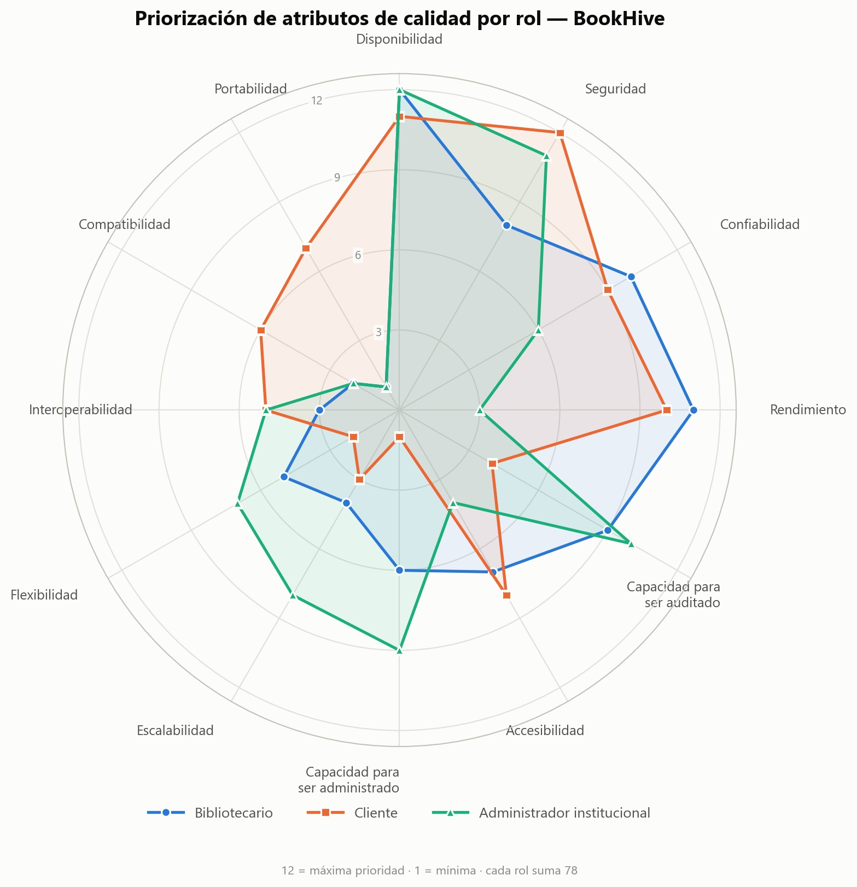
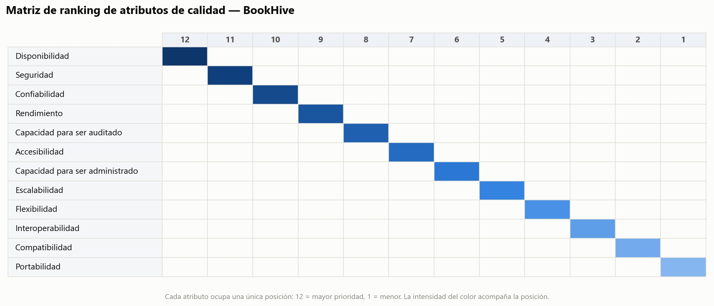

# Documento de Arquitectura de Software — BookHive

| | |
|---|---|
| **Proyecto** | BookHive — Sistema de gestión bibliotecaria multi-institucional |
| **Tipo** | SaaS multi-institucional para bibliotecas universitarias |
| **Arquitectos** | Fernando Andrés Zuluaga · Johan Camilo Bedoya |

---

## Contenido

- [1. Propósito del proyecto](#1-propósito-del-proyecto)
- [2. Motivadores de la arquitectura](#2-motivadores-de-la-arquitectura)
  - [2.1 Restricciones técnicas](#21-restricciones-técnicas) — 24
  - [2.2 Restricciones de negocio](#22-restricciones-de-negocio) — 11
  - [2.3 Atributos de calidad](#23-atributos-de-calidad) — 11
  - [2.4 Escenarios de calidad](#24-escenarios-de-calidad) — 34
  - [2.5 Funcionalidades significativas](#25-funcionalidades-significativas) — 27

---

## 1. Propósito del proyecto

BookHive es un sistema de gestión bibliotecaria pensado para bibliotecas universitarias que hoy dependen casi por completo de la atención presencial para operaciones tan básicas como consultar disponibilidad, reservar un ejemplar, revisar el estado de un préstamo o calcular y cobrar una multa. Esa dependencia genera dispersión de la información, falta de visibilidad sobre dónde está cada ejemplar, ineficiencia y demoras en los procesos de la biblioteca, y una experiencia deficiente tanto para quien administra el sistema como para el estudiante o docente que lo usa.

La visión del proyecto es automatizar la gestión bibliotecaria universitaria de punta a punta: eliminar los procesos manuales propensos a error, dar trazabilidad completa a cada operación (préstamo, devolución, multa, pago), centralizar la gestión del ciclo completo del material bibliográfico y mantener un control preciso del inventario. BookHive se construye como una única aplicación web capaz de ser usada por varias universidades — cada una con una o varias sedes — garantizando en todo momento el aislamiento total de los datos entre instituciones.

Dentro del sistema solo existen dos roles que operan directamente sobre BookHive: el Bibliotecario, encargado de gestionar préstamos, reservas, multas, el catálogo y los usuarios de su institución; y el Usuario, que agrupa a estudiantes, docentes y demás personas allegadas a la institución, quienes consultan el catálogo, reservan y gestionan sus propios préstamos y deudas. El resto de la comunidad universitaria (personal administrativo, directivos) es beneficiario indirecto del sistema, pero no actúa como actor dentro de él.

Frente a alternativas existentes en el mercado colombiano — soluciones a medida sin vocación de producto, plataformas comerciales de alto costo de licenciamiento y mantenimiento, o software libre que exige configuración técnica constante y expone a todas las instituciones que lo usan a los mismos riesgos cuando se modifica — BookHive se propone como una alternativa sin costos de licenciamiento recurrente, con propiedad total del código para la institución, construida a la escala real del problema (una o varias sedes por universidad) y abierta a integraciones futuras.

---

## 2. Motivadores de la arquitectura

Las restricciones técnicas, las restricciones de negocio y las funcionalidades significativas son los elementos que guían la selección de estilos arquitectónicos, patrones de diseño y estrategias de implementación a lo largo del proyecto.

### 2.1 Restricciones técnicas

Condiciones no negociables de tipo tecnológico que enmarcan el diseño y el desarrollo del sistema.

| # | Categoría | Tipo |
|---|---|---|
| [RT-01](#rt-01--concurrencia-y-transacciones) | Concurrencia y transacciones | Propia del proyecto |
| [RT-02](#rt-02--aislamiento-de-datos) | Aislamiento de datos | Propia del proyecto |
| [RT-03](#rt-03--integridad-de-datos-y-persistencia) | Integridad de datos y persistencia | Propia del proyecto |
| [RT-04](#rt-04--disponibilidad-y-consistencia) | Disponibilidad y consistencia | Propia del proyecto |
| [RT-05](#rt-05--seguridad-y-control-de-acceso) | Seguridad y control de acceso | Propia del proyecto |
| [RT-06](#rt-06--modelado-de-datos) | Modelado de datos | Propia del proyecto |
| [RT-07](#rt-07--concurrencia-en-colas) | Concurrencia en colas | Propia del proyecto |
| [RT-08](#rt-08--automatización-de-procesos) | Automatización de procesos | Propia del proyecto |
| [RT-09](#rt-09--integración-de-sistemas-externos) | Integración de sistemas externos | Propia del proyecto |
| [RT-10](#rt-10--arquitectura-de-despliegue) | Arquitectura de despliegue | Propia del proyecto |
| [RT-11](#rt-11--prácticas-de-diseño) | Prácticas de diseño | Propia del proyecto |
| [RT-12](#rt-12--prácticas-de-desarrollo) | Prácticas de desarrollo | Propia del proyecto |
| [RT-13](#rt-13--devops) | DevOps | Propia del proyecto |
| [RT-14](#rt-14--aseguramiento-de-calidad) | Aseguramiento de calidad | Propia del proyecto |
| [RT-15](#rt-15--monitoreo-y-observabilidad) | Monitoreo y observabilidad | Propia del proyecto |
| [RT-16](#rt-16--arquitectura-reactiva) | Arquitectura reactiva | Propia del proyecto |
| [RT-17](#rt-17--arquitectura-en-la-nube) | Arquitectura en la nube | Propia del proyecto |
| [RT-18](#rt-18--prácticas-de-desarrollo) | Prácticas de desarrollo | Propia del proyecto |
| [RT-19](#rt-19--patrones-de-diseño) | Patrones de diseño | Propia del proyecto |
| [RT-20](#rt-20--prácticas-de-desarrollo) | Prácticas de desarrollo | Propia del proyecto |
| [RT-21](#rt-21--seguridad--cifrado) | Seguridad — cifrado | Propia del proyecto |
| [RT-22](#rt-22--backup-y-recuperación-ante-desastres) | Backup y recuperación ante desastres | Propia del proyecto |
| [RT-23](#rt-23--estandarización-de-zona-horaria) | Estandarización de zona horaria | Propia del proyecto |
| [RT-24](#rt-24--retención-y-eliminación-de-datos-personales) | Retención y eliminación de datos personales | Propia del proyecto |

#### RT-01 · Concurrencia y transacciones

**Tipo:** Propia del proyecto

**Restricción.** El sistema debe implementar bloqueo transaccional a nivel de base de datos en el proceso de préstamo, garantizando atomicidad e impidiendo condiciones de carrera sobre un mismo ejemplar.

**Justificación.** Al haber múltiples usuarios consultando y reservando simultáneamente, sin bloqueo transaccional dos solicitudes podrían procesarse sobre el mismo ejemplar en el mismo instante, generando inconsistencias en el inventario y afectando la confianza de las instituciones en la plataforma.

#### RT-02 · Aislamiento de datos

**Tipo:** Propia del proyecto

**Restricción.** El sistema debe implementar una estrategia de aislamiento de datos a nivel de base de datos (esquema separado, partición por identificador de institución, o BD independiente) que impida el acceso cruzado entre universidades incluso ante fallos de la capa de aplicación.

**Justificación.** BookHive es una sola aplicación compartida por varias universidades con una o varias sedes cada una. Sin aislamiento estricto por institución existe riesgo de fuga de información entre clientes distintos, lo cual además de un problema técnico es un incumplimiento grave frente a la Ley 1581 de Habeas Data ya identificada en las restricciones legales.

#### RT-03 · Integridad de datos y persistencia

**Tipo:** Propia del proyecto

**Restricción.** Los registros del ciclo préstamo-devolución-multa-pago deben implementarse como estructuras inmutables (append-only), sin permitir operaciones de actualización o borrado directo sobre el historial transaccional.

**Justificación.** Al tratarse de operaciones con implicaciones económicas (multas) y de trazabilidad, permitir que un registro se altere después de creado abriría la puerta a manipulación de deudas o historiales, comprometiendo la confiabilidad del sistema como fuente de verdad para bibliotecarios y auditorías.

#### RT-04 · Disponibilidad y consistencia

**Tipo:** Propia del proyecto

**Restricción.** El sistema debe garantizar consistencia fuerte (no eventual) en la lectura de disponibilidad de ejemplares entre sedes de una misma universidad, evitando que consultas concurrentes devuelvan estados de inventario desactualizados.

**Justificación.** Los estudiantes pueden consultar y reservar material que se encuentra en una sede distinta a la que consultan. Sin disponibilidad en tiempo real, se generarían reservas sobre ejemplares que ya no están disponibles, afectando la operación diaria de la biblioteca.

#### RT-05 · Seguridad y control de acceso

**Tipo:** Propia del proyecto

**Restricción.** El control de acceso basado en roles debe validarse a nivel de backend/API en cada endpoint, no solo en la interfaz, verificando rol e institución del usuario autenticado.

**Justificación.** Los roles del sistema son funciones, no personas: el usuario final consulta el catálogo y gestiona sus propias reservas y deudas; el bibliotecario registra préstamos y devoluciones y gestiona el catálogo; el administrador institucional configura los parámetros de su universidad y consulta su facturación. Una misma persona puede cumplir varias de esas funciones a la vez en una biblioteca pequeña, el bibliotecario suele ser también el administrador, así que la validación no puede preguntar cuál es el rol del usuario sino si alguno de los que tiene le permite la operación. Sin esa separación, un usuario podría ejecutar operaciones administrativas indebidas.

#### RT-06 · Modelado de datos

**Tipo:** Propia del proyecto

**Restricción.** El valor de tarifa aplicado a cada deuda debe persistirse como un dato fijo (snapshot) al momento de su creación, en lugar de una referencia dinámica a la configuración de tarifas vigente.

**Justificación.** Si la tarifa se recalculara con el valor vigente en cada consulta, un cambio de tarifa alteraría deudas ya generadas, afectando la trazabilidad y generando reclamos de los usuarios sobre montos que no corresponden a la fecha real del incumplimiento.

#### RT-07 · Concurrencia en colas

**Tipo:** Propia del proyecto

**Restricción.** El orden FIFO (First In, First Out) de atención de reservas debe garantizarse incluso bajo solicitudes concurrentes, mediante control transaccional que evite condiciones de carrera en la asignación.

**Justificación.** Sin una cola ordenada y controlada a nivel transaccional, solicitudes concurrentes sobre un mismo ejemplar podrían resolverse en un orden distinto al de llegada real, generando percepción de injusticia y errores de asignación bajo alta demanda.

#### RT-08 · Automatización de procesos

**Tipo:** Propia del proyecto

**Restricción.** Las validaciones de límites por usuario y las expiraciones de préstamos/reservas vencidas deben ejecutarse mediante procesos automatizados (jobs programados o restricciones a nivel de base de datos), sin depender de intervención manual.

**Justificación.** Si la validación de límites por usuario y las expiraciones dependieran de revisión manual, quedarían sujetas a errores u omisiones del bibliotecario bajo alta carga operativa, comprometiendo la aplicación consistente de las políticas de préstamo y el control confiable del inventario.

#### RT-09 · Integración de sistemas externos

**Tipo:** Propia del proyecto

**Restricción.** La integración con la pasarela de pagos debe garantizar que las credenciales de conexión estén protegidas, que cada confirmación de pago se procese correctamente aunque llegue con retraso, y que un mismo pago no quede registrado más de una vez aunque el proceso falle y se reintente.

**Justificación.** Sin conciliación asíncrona confiable (webhooks) y registro idempotente de las transacciones, existe riesgo de perder confirmaciones de pago o de duplicar cobros a un mismo usuario, además de incumplir la Ley 527 de Comercio Electrónico ya identificada como restricción legal.

#### RT-10 · Arquitectura de despliegue

**Tipo:** Propia del proyecto

**Restricción.** El sistema debe implementarse como una aplicación web responsive, compatible con los navegadores modernos más usados, sin dependencias de instalación local.

**Justificación.** Al servir a bibliotecarios y usuarios de múltiples universidades y sedes, una arquitectura web evita fricciones de instalación y actualización, y facilita el acceso simultáneo desde distintos dispositivos sin depender de un sistema operativo específico.

#### RT-11 · Prácticas de diseño

**Tipo:** Propia del proyecto

**Restricción.** El desarrollo del sistema debe seguir principios SOLID para favorecer la mantenibilidad, modularidad y escalabilidad del código.

**Justificación.** Aplicar los principios SOLID reduce el acoplamiento entre los módulos del sistema (catálogo, préstamos, multas, pagos), facilitando que cambios futuros en un módulo, como agregar un nuevo método de pago, no obliguen a modificar el resto del código ni introduzcan errores en funcionalidades ya probadas.

#### RT-12 · Prácticas de desarrollo

**Tipo:** Propia del proyecto

**Restricción.** El sistema debe aplicar prácticas de Clean Code, evitando duplicación de código, nombres ambiguos y estructuras innecesariamente complejas.

**Justificación.** Un código con nombres ambiguos o duplicación dificulta el mantenimiento del sistema, especialmente en reglas de negocio encadenadas como el ciclo préstamo-devolución-multa-pago, donde un error de lectura del código puede traducirse en errores de cálculo de multas o inconsistencias en el inventario.

#### RT-13 · DevOps

**Tipo:** Propia del proyecto

**Restricción.** El proyecto debe implementar prácticas de integración y despliegue continuo, incluyendo pruebas automatizadas antes de realizar nuevos despliegues.

**Justificación.** Sin integración y despliegue continuo con pruebas automatizadas, cada cambio en reglas críticas (como el bloqueo transaccional de préstamos o el cálculo de multas) tendría que verificarse manualmente antes de cada despliegue, aumentando el riesgo de introducir errores en producción sin detectarlos a tiempo.

#### RT-14 · Aseguramiento de calidad

**Tipo:** Propia del proyecto

**Restricción.** El sistema debe contar con pruebas automatizadas (unitarias y de integración) que cubran especialmente los flujos críticos de concurrencia (préstamo, cola de reservas) y el cálculo de multas.

**Justificación.** Estos son los flujos de mayor riesgo según los propios retos técnicos del proyecto. Sin pruebas automatizadas que validen su comportamiento bajo condiciones concurrentes, un cambio de código podría introducir errores difíciles de detectar antes de un despliegue.

#### RT-15 · Monitoreo y observabilidad

**Tipo:** Propia del proyecto

**Restricción.** El sistema debe registrar logs estructurados y trazabilidad de errores en operaciones críticas (pagos, préstamos, multas), permitiendo auditar cualquier incidencia reportada por una institución.

**Justificación.** Al manejar transacciones financieras y datos de varias universidades, ante un reclamo el equipo debe poder reconstruir qué ocurrió en el sistema sin depender de lo que recuerde el bibliotecario o el usuario involucrado.

#### RT-16 · Arquitectura reactiva

**Tipo:** Propia del proyecto

**Restricción.** El sistema debe diseñarse siguiendo los principios del Manifiesto de Aplicaciones Reactivas (responsivo, resiliente, elástico y orientado a mensajes), especialmente en los flujos de consulta de disponibilidad y procesamiento de préstamos.

**Justificación.** Dado que múltiples universidades y sedes consultan y reservan el catálogo simultáneamente, el sistema debe responder con tiempos consistentes bajo carga, recuperarse ante fallos parciales sin afectar la disponibilidad general, y escalar de forma elástica al incorporar nuevas instituciones.

#### RT-17 · Arquitectura en la nube

**Tipo:** Propia del proyecto

**Restricción.** La arquitectura de despliegue debe seguir los pilares del Well-Architected Framework: excelencia operacional, seguridad, confiabilidad, rendimiento y optimización de costos.

**Justificación.** Con presupuesto limitado (aportado por los propios desarrolladores) y datos sensibles de varias instituciones, las decisiones de infraestructura deben equilibrar seguridad y confiabilidad con uso eficiente de recursos, evitando sobrecostos de nube no planeados.

#### RT-18 · Prácticas de desarrollo

**Tipo:** Propia del proyecto

**Restricción.** El backend debe seguir los principios de la metodología 12-Factor App (configuración externalizada, procesos sin estado, dependencias explícitas, logs como flujo de eventos).

**Justificación.** Estos principios permiten desplegar el mismo código en distintos entornos (desarrollo, pruebas, producción) sin cambios manuales, y escalar horizontalmente el backend a medida que crece el número de universidades atendidas.

#### RT-19 · Patrones de diseño

**Tipo:** Propia del proyecto

**Restricción.** El sistema debe aplicar patrones de diseño reconocidos (GoF, GRASP, DRY, KISS) en el modelado de las reglas de negocio del ciclo préstamo-devolución-multa-pago.

**Justificación.** Las reglas de negocio encadenadas (vencimiento → multa → bloqueo) son propensas a duplicarse o volverse difíciles de seguir sin patrones claros de asignación de responsabilidades, aumentando el riesgo de inconsistencias entre módulos.

#### RT-20 · Prácticas de desarrollo

**Tipo:** Propia del proyecto

**Restricción.** La estrategia de adopción de la nube debe planificarse siguiendo el Cloud Adoption Framework, cubriendo gobernanza, gestión del cambio y desarrollo de habilidades del equipo.

**Justificación.** Con un equipo reducido y presupuesto de infraestructura limitado, una estrategia de adopción de nube estructurada reduce el riesgo de decisiones de arquitectura improvisadas y costosas de revertir.

#### RT-21 · Seguridad — cifrado

**Tipo:** Propia del proyecto

**Restricción.** Toda comunicación entre el cliente y el servidor debe realizarse exclusivamente mediante HTTPS/TLS. Los datos personales de usuarios y la información financiera de instituciones deben almacenarse cifrados en reposo en la base de datos.

**Justificación.** BookHive almacena datos personales de estudiantes y registros de transacciones económicas. Sin cifrado en tránsito, esa información puede ser interceptada en redes institucionales. Sin cifrado en reposo, un acceso no autorizado a la infraestructura expone directamente los datos de todas las instituciones. Ambas medidas son exigidas por la Ley 1273 de 2009 (delitos informáticos) y la Ley 1581 de 2012 (Habeas Data).

#### RT-22 · Backup y recuperación ante desastres

**Tipo:** Propia del proyecto

**Restricción.** El sistema debe contar con copias de seguridad automáticas de la base de datos con una frecuencia mínima diaria, y debe definirse un tiempo máximo de recuperación (RTO) y un punto máximo de pérdida de datos aceptable (RPO) antes del inicio del ambiente productivo.

**Justificación.** BookHive gestiona datos financieros y de trazabilidad de múltiples instituciones. Un fallo de infraestructura sin política de backup puede resultar en pérdida permanente de registros de préstamos, multas y pagos, con implicaciones legales y operativas para las instituciones cliente. Sin un RTO definido, no es posible comprometer un nivel de servicio ante las universidades.

#### RT-23 · Estandarización de zona horaria

**Tipo:** Propia del proyecto

**Restricción.** Todos los timestamps generados por el sistema — registros de préstamos, devoluciones, multas, pagos y auditoría — deben almacenarse en UTC y convertirse a la zona horaria local únicamente en la capa de presentación.

**Justificación.** El cálculo de multas depende de la comparación exacta entre la fecha de vencimiento y la fecha de devolución. Si el servidor, la base de datos y el cliente operan con zonas horarias distintas o no gestionadas de forma uniforme, una devolución realizada antes del límite puede registrarse como tardía, generando multas incorrectas y reclamos de usuarios. Almacenar en UTC elimina esta ambigüedad independientemente de la ubicación del servidor o del usuario.

#### RT-24 · Retención y eliminación de datos personales

**Tipo:** Propia del proyecto

**Restricción.** El sistema debe definir una política de retención de datos personales de usuarios acorde con la Ley 1581 de 2012, estableciendo el tiempo máximo de conservación de datos inactivos y el mecanismo para atender solicitudes de eliminación sin vulnerar la inmutabilidad de los registros de auditoría financiera.

**Justificación.** La Ley 1581 exige que los datos personales se conserven solo mientras sea necesario para la finalidad que motivó su recolección. Sin embargo, los registros de préstamos y multas tienen valor probatorio que puede requerirse después de que un usuario se dé de baja. La restricción debe definir qué datos se anonimiza al eliminar un usuario y cuáles se conservan en el log de auditoría, resolviendo explícitamente esta tensión antes del desarrollo.

---

### 2.2 Restricciones de negocio

Condicionantes externos al desarrollo que provienen del contexto legal, financiero y organizacional del proyecto.

| # | Restricción | Tipo |
|---|---|---|
| [RN-01](#rn-01--cumplir-con-la-ley-1581-de-2012-y-el-decreto-1377-de-2013-habeas-data-en-el-tratamiento-de-datos-personales-de-estudiantes-y-funcionarios-universitarios) | Cumplir con la Ley 1581 de 2012 y el Decreto 1377 de 2013 (Habeas Data) en el tratamiento de datos personales de estudiantes y funcionarios universitarios | Legal |
| [RN-02](#rn-02--cumplir-con-la-ley-527-de-1999-comercio-electrónico-en-el-procesamiento-de-pagos-digitales-de-multas-y-cuotas-de-licencia) | Cumplir con la Ley 527 de 1999 (Comercio Electrónico) en el procesamiento de pagos digitales de multas y cuotas de licencia | Legal |
| [RN-03](#rn-03--cumplir-con-la-ley-1273-de-2009-delitos-informáticos-respecto-a-la-protección-de-la-información-y-accesos-no-autorizados) | Cumplir con la Ley 1273 de 2009 (Delitos Informáticos) respecto a la protección de la información y accesos no autorizados | Legal |
| [RN-04](#rn-04--la-incorporación-de-una-institución-requiere-un-acuerdo-previo-con-su-área-de-ti-para-validar-el-dominio-de-correo-institucional) | La incorporación de una institución requiere un acuerdo previo con su área de TI para validar el dominio de correo institucional | Proceso |
| [RN-05](#rn-05--el-modelo-de-facturación-depende-de-la-medición-de-volumen-de-datos-que-debe-ser-auditable-y-reproducible-por-la-institución) | El modelo de facturación depende de la medición de volumen de datos, que debe ser auditable y reproducible por la institución | Proceso |
| [RN-06](#rn-06--cumplir-con-la-ley-1915-de-2018-reforma-a-derechos-de-autor-para-bibliotecas-en-la-gestión-del-catálogo-digital) | Cumplir con la Ley 1915 de 2018 (reforma a derechos de autor para bibliotecas) en la gestión del catálogo digital | Legal |
| [RN-07](#rn-07--cumplir-con-el-decreto-1074-de-2015-art-2222552-sobre-transferencia-internacional-de-datos-al-usar-infraestructura-en-la-nube-fuera-de-colombia) | Cumplir con el Decreto 1074 de 2015 (Art. 2.2.2.25.5.2) sobre transferencia internacional de datos al usar infraestructura en la nube fuera de Colombia | Legal |
| [RN-08](#rn-08--cumplir-con-la-obligación-de-facturación-electrónica-dian-resolución-000042-de-2020-y-sus-modificaciones-en-el-cobro-de-cuotas-de-licencia-a-instituciones) | Cumplir con la obligación de facturación electrónica DIAN (Resolución 000042 de 2020 y sus modificaciones) en el cobro de cuotas de licencia a instituciones | Legal |
| [RN-09](#rn-09--cumplir-con-la-ley-1480-de-2011-estatuto-del-consumidor-en-la-prestación-del-servicio-y-los-contratos-con-instituciones-cliente) | Cumplir con la Ley 1480 de 2011 (Estatuto del Consumidor) en la prestación del servicio y los contratos con instituciones cliente | Legal |
| [RN-10](#rn-10--las-reglas-de-negocio-tarifas-de-multas-plazos-de-pago-montos-por-volumen-de-datos-no-están-completamente-definidas-por-las-instituciones-cliente-al-momento-del-desarrollo) | Las reglas de negocio (tarifas de multas, plazos de pago, montos por volumen de datos) no están completamente definidas por las instituciones cliente al momento del desarrollo | Proceso |
| [RN-11](#rn-11--el-proyecto-cuenta-con-un-presupuesto-fijo-de-15000000-cop-aportado-por-el-equipo-de-desarrollo-distribuido-así-infraestructura-cloud-servidores-base-de-datos-y-almacenamiento-8000000-cop-dominio-y-certificado-ssl-300000-cop-herramientas-de-desarrollo-y-licencias-1500000-cop-integración-con-pasarela-de-pagos-pse-ambiente-de-pruebas--activación-básica-1200000-cop-reserva-de-contingencia-4000000-cop) | El proyecto cuenta con un presupuesto fijo de $15.000.000 COP aportado por el equipo de desarrollo, distribuido así: infraestructura cloud (servidores, base de datos y almacenamiento): $8.000.000 COP; dominio y certificado SSL: $300.000 COP; herramientas de desarrollo y licencias: $1.500.000 COP; integración con pasarela de pagos PSE (ambiente de pruebas + activación básica): $1.200.000 COP; reserva de contingencia: $4.000.000 COP | Presupuesto |

#### RN-01 · Cumplir con la Ley 1581 de 2012 y el Decreto 1377 de 2013 (Habeas Data) en el tratamiento de datos personales de estudiantes y funcionarios universitarios

**Tipo:** Legal

**Justificación.** BookHive almacena nombre, correo institucional, historial de actividad de cada usuario y datos personales. La ley exige consentimiento informado, política de privacidad y derecho del usuario a acceder, corregir o eliminar sus datos. El incumplimiento puede generar sanciones de la SIC.

**Plan de acción.** Implementar aviso de privacidad en el registro y un mecanismo de solicitud de eliminación de datos accesible al usuario para el cumplimiento del tema de la gestión de usuarios.

#### RN-02 · Cumplir con la Ley 527 de 1999 (Comercio Electrónico) en el procesamiento de pagos digitales de multas y cuotas de licencia

**Tipo:** Legal

**Justificación.** BookHive procesa transacciones económicas electrónicas. Esta ley regula su validez jurídica en Colombia y exige que los registros de pago sean trazables, íntegros y con valor probatorio.

**Plan de acción.** Garantizar que cada transacción quede registrada con: fecha y hora exactas del servidor, identificador del usuario, monto, concepto del pago (multa o cuota de licencia), referencia de la transacción emitida por el servicio de pagos y el resultado de la operación (exitosa, fallida o pendiente). Estos registros deben almacenarse en el historial de pagos sin que después se puedan modificar ni borrar.

#### RN-03 · Cumplir con la Ley 1273 de 2009 (Delitos Informáticos) respecto a la protección de la información y accesos no autorizados

**Tipo:** Legal

**Justificación.** BookHive maneja datos de múltiples instituciones en infraestructura compartida. La ley penaliza el acceso no autorizado a sistemas y la interceptación de datos. La separación de datos entre instituciones es una obligación legal además de técnica.

**Plan de acción.** Implementar cifrado de los datos tanto cuando viajan por la red como cuando están guardados, control de acceso por roles y auditoría de eventos críticos que permita trazabilidad ante incidentes.

#### RN-04 · La incorporación de una institución requiere un acuerdo previo con su área de TI para validar el dominio de correo institucional

**Tipo:** Proceso

**Justificación.** Sin conocer el dominio oficial de cada universidad no es posible activar el registro de sus usuarios ni garantizar el aislamiento de datos. Este paso no puede automatizarse sin intervención humana de ambas partes.

**Plan de acción.** Definir un proceso formal de incorporación institucional con verificación del dominio antes de activar cualquier institución en la plataforma.

#### RN-05 · El modelo de facturación depende de la medición de volumen de datos, que debe ser auditable y reproducible por la institución

**Tipo:** Proceso

**Justificación.** Si una institución cuestiona el valor de su cuota, BookHive debe poder demostrar cómo se midió el volumen y qué tarifa se aplicó en ese periodo. Sin trazabilidad del cálculo, el cobro carece de sustento.

**Plan de acción.** Conservar el registro detallado de cada medición periódica (fecha, volumen calculado, tarifa aplicada) sin que después se pueda modificar, y consultable por el administrador institucional.

#### RN-06 · Cumplir con la Ley 1915 de 2018 (reforma a derechos de autor para bibliotecas) en la gestión del catálogo digital

**Tipo:** Legal

**Justificación.** La Ley 1915 de 2018 permite a las bibliotecas poner obras a disposición de sus usuarios a través de terminales especializados para investigación o estudio personal, pero únicamente si dichas obras fueron lícitamente adquiridas. BookHive no puede alojar ni distribuir libros digitales que no cuenten con licencia válida; la institución que registra el contenido es legalmente responsable de acreditar esa licencia.

**Plan de acción.** Establecer en el contrato de servicio que la institución declara contar con las licencias de todo el material digital que registre en la plataforma y que es la responsable de acreditarlas ante cualquier reclamación.

#### RN-07 · Cumplir con el Decreto 1074 de 2015 (Art. 2.2.2.25.5.2) sobre transferencia internacional de datos al usar infraestructura en la nube fuera de Colombia

**Tipo:** Legal

**Justificación.** Si BookHive se despliega en proveedores de infraestructura en la nube con servidores ubicados fuera del territorio colombiano, el uso de datos personales de estudiantes y funcionarios en esa infraestructura constituye una transferencia internacional de datos bajo la Ley 1581 de 2012 y su decreto reglamentario. Sin un contrato de transmisión de datos con el proveedor que garantice las mismas protecciones, el tratamiento es ilegal y puede acarrear sanciones de la SIC.

**Plan de acción.** Suscribir un contrato de transmisión o transferencia internacional de datos con el proveedor de nube antes de activar el ambiente productivo. Si la nube elegida no ofrece regiones en Colombia, documentar el contrato como evidencia de cumplimiento y mencionarlo en la política de privacidad de la plataforma.

#### RN-08 · Cumplir con la obligación de facturación electrónica DIAN (Resolución 000042 de 2020 y sus modificaciones) en el cobro de cuotas de licencia a instituciones

**Tipo:** Legal

**Justificación.** BookHive genera cobros periódicos a instituciones universitarias por el uso de la plataforma. En Colombia, toda empresa que venda bienes o preste servicios está obligada a emitir facturas electrónicas validadas por la DIAN mediante un proveedor tecnológico autorizado. Emitir recibos internos sin validación DIAN no tiene valor fiscal ni probatorio para las instituciones cliente.

**Plan de acción.** La integración con un proveedor tecnológico autorizado por la DIAN se planifica para la fase comercial posterior al MVP académico, dado que su costo operativo supera el presupuesto disponible durante el desarrollo. Durante el MVP, el módulo de facturación generará registros internos de cobro con los datos requeridos (institución, periodo, monto, tarifa aplicada) que servirán como base para la integración formal con la DIAN en la fase siguiente.

#### RN-09 · Cumplir con la Ley 1480 de 2011 (Estatuto del Consumidor) en la prestación del servicio y los contratos con instituciones cliente

**Tipo:** Legal

**Justificación.** BookHive es un proveedor de servicios digitales y está sujeto al Estatuto del Consumidor colombiano. Esto implica: transparencia en precios y condiciones del servicio antes de la contratación, derecho a reversión de pagos electrónicos en caso de fraude o no prestación del servicio, y garantía mínima del servicio contratado. El incumplimiento puede generar reclamaciones ante la SIC y multas.

**Plan de acción.** Publicar un contrato de servicio claro con las condiciones, precios, compromisos de servicio y política de cancelación antes de activar cualquier institución. Implementar el mecanismo de reversión de pago electrónico exigido por el artículo 51 de la ley en el flujo de pagos.

#### RN-10 · Las reglas de negocio (tarifas de multas, plazos de pago, montos por volumen de datos) no están completamente definidas por las instituciones cliente al momento del desarrollo

**Tipo:** Proceso

**Justificación.** Cada universidad tiene políticas internas diferentes para el manejo de multas, períodos de préstamo y umbrales de facturación. Diseñar valores fijos en el código impediría que el sistema se adapte a cada institución sin intervención de desarrollo, lo que aumentaría el tiempo y costo de onboarding.

**Plan de acción.** Diseñar todos los parámetros de negocio (montos de multas, plazos, rangos de volumen y tarifas) como configuración por institución, editable por el administrador institucional desde el panel de administración, sin necesidad de cambios en el código fuente.

#### RN-11 · El proyecto cuenta con un presupuesto fijo de $15.000.000 COP aportado por el equipo de desarrollo, distribuido así: infraestructura cloud (servidores, base de datos y almacenamiento): $8.000.000 COP; dominio y certificado SSL: $300.000 COP; herramientas de desarrollo y licencias: $1.500.000 COP; integración con pasarela de pagos PSE (ambiente de pruebas + activación básica): $1.200.000 COP; reserva de contingencia: $4.000.000 COP

**Tipo:** Presupuesto

**Justificación.** El financiamiento es propio del equipo sin inversión externa, lo que obliga a priorizar servicios y herramientas en sus planes gratuitos durante el desarrollo y a diferir integraciones de alto costo operativo —como la facturación electrónica de la DIAN— para una fase comercial posterior en la que el sistema genere ingresos propios.

**Plan de acción.** Priorizar herramientas y servicios disponibles en el plan gratuito durante el desarrollo y las pruebas. Activar recursos de pago únicamente para el ambiente de demostración final.

---

### 2.3 Atributos de calidad

Para identificarlos y priorizarlos, el equipo realizó una lluvia de escenarios de calidad con 100 ideas aportadas desde la perspectiva de los tres roles interesados en el sistema (bibliotecario, cliente y administrador institucional), y luego cada rol ponderó los 12 atributos de calidad definidos por el equipo, asignando 12 al de mayor prioridad y 1 al de menor. El resultado de esa priorización, expresado como ponderador global, es el siguiente:

| Atributo de calidad | Bibliotecario | Cliente | Administrador institucional | Ponderador global |
|---|---|---|---|---|
| Disponibilidad | 12 | 11 | 12 | 15% |
| Seguridad | 8 | 12 | 11 | 13% |
| Confiabilidad | 10 | 9 | 6 | 11% |
| Rendimiento | 11 | 10 | 3 | 10% |
| Capacidad para ser auditado | 9 | 4 | 10 | 10% |
| Accesibilidad | 7 | 8 | 4 | 8% |
| Capacidad para ser administrado | 6 | 1 | 9 | 7% |
| Escalabilidad | 4 | 3 | 8 | 6% |
| Flexibilidad | 5 | 2 | 7 | 6% |
| Interoperabilidad | 3 | 5 | 5 | 6% |
| Compatibilidad | 2 | 6 | 2 | 4% |
| Portabilidad | 1 | 7 | 1 | 4% |
| **Total** | **78** | **78** | **78** | **100%** |

*Figura: comparación visual (gráfico de radar) de la ponderación otorgada por cada rol a los 12 atributos de calidad.*

#### Matriz de tiempos

Estos 8 escenarios formalizan en SEI el atributo de calidad **Rendimiento**, priorizados por el equipo a partir de la lluvia de escenarios. Las columnas *Valor de negocio* y *Riesgo técnico* siguen el mismo criterio de dos ejes (Alta/Media/Baja) usado para priorizar las funcionalidades significativas del sistema.

| ID | Fuente del estímulo (rol) | Estímulo | Artefacto / Entorno | Respuesta del sistema | Medida de respuesta (tiempo) | Valor de negocio | Riesgo técnico | Justificación | Duda / riesgo abierto | Tácticas arquitectónicas aplicables |
|---|---|---|---|---|---|---|---|---|---|---|
| US-08 | Cliente (estudiante / docente / allegado) | Cancelar un cliente una reserva activa, existiendo otras personas en la fila de espera del mismo título. | Módulo de gestión de colas de reserva — Operación normal | El sistema notifica la disponibilidad a la siguiente persona en la fila de forma inmediata, sin demoras perceptibles para el usuario. | La notificación se envía en menos de 3 segundos en el 95% de los casos. | Media | Media | Este escenario tiene alto valor de negocio porque cuando alguien cancela una reserva, la siguiente persona en la fila probablemente lleva tiempo esperando ese título; notificarle rápido convierte un ejemplar liberado en una buena experiencia, mientras que una notificación lenta puede hacer que la persona pierda el interés o consiga el libro por otro lado, sin que BookHive se entere de esa oportunidad perdida. | ¿El tiempo de 3 segundos incluye la entrega real al proveedor de correo/push, o solo el momento en que BookHive encola la notificación? Si el proveedor externo es lento, no está claro si ese tiempo cuenta para cumplir o no la meta. | Cola de eventos (RabbitMQ o AWS SQS) para notificaciones asíncronas; servicio de envío desacoplado (por ejemplo SendGrid o Firebase Cloud Messaging). |
| US-09 | Cliente (estudiante / docente / allegado) | Confirmar la aceptación del aviso de tratamiento de datos durante el registro, en un periodo de alta concurrencia de clientes. | Módulo de registro de cuenta — Alta concurrencia | El sistema procesa la confirmación de forma fluida y sin bloqueos perceptibles para el usuario, incluso cuando múltiples clientes confirman su aceptación al mismo tiempo. | El 95% de las confirmaciones se procesan y el flujo continúa en menos de 2 segundos, incluso con registros simultáneos de múltiples usuarios. | Media | Media | Este escenario importa porque ocurre justo en medio del flujo de registro, si se traba en momentos de alta demanda (como el inicio de semestre, cuando muchos estudiantes se registran a la vez), puede frenar la entrada de nuevos usuarios exactamente cuando más se necesita que el proceso sea fluido. | El escenario asume 'alta concurrencia' pero no define una cifra — ¿son 50, 200 o 500 registros simultáneos? Sin ese número de referencia no se puede probar objetivamente si se cumple o no. | Balanceador de carga (nginx o AWS ELB) frente a múltiples instancias del servicio de registro; escritura en cola (RabbitMQ) antes de confirmar al usuario. |
| US-12 | Bibliotecario | Consultar el historial completo de préstamos y reservas de un usuario para atender un reclamo, sobre un historial con muchos movimientos registrados | Módulo de historial de usuario — Operación normal | El sistema localiza el movimiento específico solicitado dentro del historial. | El sistema devuelve el resultado de la búsqueda dentro del historial en menos de 2 segundos en el 95% de los casos, incluso con un historial de alto volumen de movimientos. | Media | Media | Este escenario tiene alto valor de negocio porque atender un reclamo es uno de los momentos más sensibles de la relación con el cliente: la persona ya está inconforme y espera una respuesta inmediata. Si el bibliotecario no logra ubicar el movimiento específico rápidamente dentro de un historial extenso, la espera prolonga la frustración del cliente y puede convertir un reclamo menor en una queja formal hacia la institución, dañando la percepción de BookHive como una herramienta que agiliza, y no entorpece, la atención al usuario. | El escenario dice 'alto volumen' de movimientos, pero no hay un número de referencia (¿cientos, miles?) para diseñar el índice adecuado y saber si 2 segundos es una meta realista. | Índice compuesto en base de datos (por ejemplo, PostgreSQL) sobre usuario + fecha + tipo de movimiento; paginación de resultados (cursor-based o por offset). |
| US-13 | Bibliotecario | Registrar la devolución de un ejemplar en tiempos de alta concurrencia | Módulo de devoluciones — Alta concurrencia | El sistema confirma la devolución sin lentitud perceptible y, cuando corresponde, muestra el detalle de la multa asociada. | La confirmación de la devolución, incluyendo el desglose de la multa cuando aplica, aparece en menos de 2 segundos en al menos el 95% de los casos, incluso bajo alta concurrencia en el mostrador. | Alta | Alta | Este escenario tiene un alto valor de negocio porque la devolución es una de las operaciones más frecuentes del sistema y ocurre justo en los momentos de mayor afluencia en el mostrador. Si la confirmación o el desglose de la multa tardan, o exigen navegar a otra pantalla, se generan filas más largas y una atención tan lenta como la presencial que BookHive busca reemplazar, afectando directamente la experiencia del cliente que espera y la percepción de eficiencia de la institución sobre la plataforma. | ¿El cálculo de la multa por retraso (encapsulado en el patrón Strategy ya definido) usa reglas precargadas en memoria o consulta la base de datos en cada devolución? Eso afecta si se puede cumplir el tiempo de 2 segundos bajo alta concurrencia en el mostrador. | Patrón Unit of Work (transacción única para el cierre del préstamo, la actualización del inventario y el registro de la multa); patrón Strategy para el cálculo de la mora según la regla de cada institución; patrón State para las transiciones válidas del préstamo, implementados en la capa de servicio. |
| US-15 | Cliente / Bibliotecario / Administrador institucional | Ejecutar alguna de las operaciones principales del sistema (préstamo de ejemplar, búsqueda en catálogo, reserva de ejemplar) solicitada por el usuario. | Sistema completo — Alta concurrencia | El sistema termina la operación solicitada y muestra el resultado al usuario | Cada operación principal se procesa en un máximo de 3 segundos en al menos 95 de cada 100 solicitudes | Alta | Alta | Este escenario es clave para el negocio porque prueba las operaciones más usadas del sistema bajo carga real; si BookHive se vuelve lento en hora pico, no se sostiene la promesa central del producto, que es ser más rápido que la atención presencial. | ¿Qué tan alta es la concurrencia real esperada (número de usuarios activos simultáneos) en horas pico? Sin esa cifra de referencia es difícil saber si 3 segundos es una meta alcanzable o ya demasiado ambiciosa para la infraestructura planeada. | Balanceador de carga con múltiples instancias (auto-scaling); caché (Redis o Memcached) para resultados de búsqueda frecuentes en el catálogo. |
| US-17 | Cliente / Bibliotecario / Administrador institucional | Completar y enviar un formulario de registro con los campos requeridos (por ejemplo, un préstamo, una cuenta, un título, una sede o una categoría). | Módulos de registro del sistema (préstamos, cuentas, catálogo, sedes, categorías) — Operación normal | El sistema valida los campos ingresados y guarda el registro, confirmando el resultado al usuario. | El registro se valida y se guarda en menos de 3 segundos en el 95% de los casos, sin importar el tipo de entidad registrada, incluso al crear 10 o más registros de forma consecutiva en la misma sesión, sin que el tiempo de respuesta se degrade. | Media | Media | Este escenario tiene alto valor de negocio porque registrar información (préstamos, cuentas, títulos, sedes, categorías) es la actividad más frecuente del día a día en BookHive; si cualquiera de estos formularios se vuelve lento, el efecto se multiplica por la cantidad de veces que se usa, generando una fricción constante en la operación diaria de bibliotecarios y administradores. | ¿Todos los tipos de registro mencionados (préstamo, cuenta, título, sede, categoría) pasan por el mismo mecanismo de guardado, o cada uno tiene su propia lógica? Si son muy distintos entre sí, medirlos a todos con el mismo número de 3 segundos podría no ser justo para todos los casos. | Transacciones cortas de base de datos con validación en la misma capa de servicio (sin llamadas externas síncronas); pruebas de carga (JMeter o k6) para validar que no haya degradación con uso repetido. |
| US-18 | Cliente / Bibliotecario / Administrador institucional | Consultar información específica dentro del sistema — por ejemplo, un historial de pagos, un reporte mensual de operación, el historial de aceptación de tratamiento de datos, el estado de una solicitud, o un título del catálogo. | Módulos de consulta del sistema (pagos, reportes, catálogo, cuentas) — Operación normal | El sistema procesa la consulta y despliega el resultado solicitado, sin importar el volumen de información consultada. | El resultado de la consulta se muestra en menos de 3 segundos en el 95% de los casos, sin importar el tipo de información o el volumen de registros consultados. | Media | Media | Este escenario tiene alto valor de negocio porque consultar información (pagos, reportes, historial, catálogo) es la base de decisiones diarias para bibliotecarios y administradores; si estas consultas son lentas, se retrasan tareas críticas como atender un reclamo o hacer una revisión de cumplimiento con tiempo limitado. | ¿El reporte mensual de operación se genera en tiempo real en cada consulta, o se podría precalcular? Si se calcula en vivo sobre todo el histórico de la institución, el tiempo de 3 segundos podría ser difícil de cumplir sin algún tipo de precálculo o caché. | Índices en las tablas más consultadas; caché (Redis) para reportes recurrentes como el mensual; paginación y filtros aplicados en el backend. |
| US-20 | Cliente / Bibliotecario / Administrador institucional | Consultar información específica dentro del sistema — por ejemplo, un historial de pagos, un reporte mensual de operación, el historial de aceptación de tratamiento de datos, el estado de una solicitud, o un título del catálogo. | Módulos de consulta del sistema (pagos, reportes, catálogo, cuentas) — Operación normal | El sistema procesa la consulta y despliega el resultado solicitado, sin importar el volumen de información consultada. | El resultado de la consulta se muestra en menos de 3 segundos en el 95% de los casos, sin importar el tipo de información o el volumen de registros consultados. | Alta | Media | Este escenario tiene alto valor de negocio porque consultar información (pagos, reportes, historial, catálogo) es la base de decisiones diarias para bibliotecarios y administradores; si estas consultas son lentas, se retrasan tareas críticas como atender un reclamo o hacer una revisión de cumplimiento con tiempo limitado. | ¿El reporte mensual de operación se genera en tiempo real en cada consulta, o se podría precalcular? Si se calcula en vivo sobre todo el histórico de la institución, el tiempo de 3 segundos podría ser difícil de cumplir sin algún tipo de precálculo o caché. | Índices en las tablas más consultadas; caché (Redis) para reportes recurrentes como el mensual; paginación y filtros aplicados en el backend. |

---

### 2.4 Escenarios de calidad

Los escenarios se formalizan en el formato SEI: **fuente del estímulo, estímulo, artefacto, ambiente, respuesta y medida de respuesta**. Cada uno agrega la justificación de negocio que lo motiva, la duda abierta que queda por resolver y las tácticas arquitectónicas con las que se piensa atender.

| Atributo de calidad | Escenarios |
|---|---|
| Disponibilidad | [US-16](#us-16--disponibilidad), [US-24](#us-24--disponibilidad), [US-31](#us-31--disponibilidad), [US-32](#us-32--disponibilidad) |
| Seguridad | [US-01](#us-01--seguridad), [US-04](#us-04--seguridad), [US-07](#us-07--seguridad), [US-14](#us-14--seguridad), [US-19](#us-19--seguridad) |
| Confiabilidad | [US-05](#us-05--confiabilidad), [US-06](#us-06--confiabilidad), [US-10](#us-10--confiabilidad), [US-11](#us-11--confiabilidad), [US-21](#us-21--confiabilidad) |
| Rendimiento | [US-08](#us-08--rendimiento), [US-09](#us-09--rendimiento), [US-12](#us-12--rendimiento), [US-13](#us-13--rendimiento), [US-15](#us-15--rendimiento), [US-17](#us-17--rendimiento), [US-18](#us-18--rendimiento) |
| Capacidad para ser auditado | [US-20](#us-20--capacidad-para-ser-auditado), [US-33](#us-33--capacidad-para-ser-auditado) |
| Accesibilidad | [US-28](#us-28--accesibilidad), [US-29](#us-29--accesibilidad), [US-30](#us-30--accesibilidad) |
| Capacidad para ser administrado | [US-25](#us-25--capacidad-para-ser-administrado) |
| Escalabilidad | [US-26](#us-26--escalabilidad), [US-27](#us-27--escalabilidad) |
| Flexibilidad | [US-22](#us-22--flexibilidad) |
| Interoperabilidad | [US-23](#us-23--interoperabilidad), [US-34](#us-34--interoperabilidad) |
| Compatibilidad | [US-03](#us-03--compatibilidad) |
| Portabilidad | [US-02](#us-02--portabilidad) |

#### US-01 — Seguridad

- **Fuente:** Bibliotecario
- **Estímulo:** Realizar múltiples intentos de activar una tarifa de multa sin contar con el rol o la autorización institucional correspondiente.
- **Artefacto:** Módulo de configuración de tarifas
- **Ambiente:** Operación normal
- **Respuesta:** El sistema mantiene el rechazo de forma consistente ante todos los intentos no autorizados y limita las solicitudes repetidas desde un mismo origen, dejando cada intento registrado con usuario, fecha y hora.
- **Métrica:** El 100% de los intentos sin autorización son rechazados y registrados, y tras 5 intentos fallidos consecutivos desde el mismo origen, el sistema bloquea temporalmente nuevas solicitudes durante al menos 10 minutos.
- **Prioridad / Dificultad:** Alta / Media
- **Justificación de negocio:** Este escenario tiene alto valor de negocio porque cambiar la tarifa de multas es una acción financiera que afecta a toda la institución; si un actor pudiera intentarlo repetidamente hasta encontrar una falla de autorización, sin que el sistema reaccione ante el patrón de intentos, la institución quedaría expuesta a un fraude prolongado en vez de detenerlo desde el primer intento.
- **Duda abierta:** ¿El sistema ya cuenta con un mecanismo de limitación de intentos (rate limiting) reutilizable para todas las acciones administrativas sensibles, o habría que construir uno específico solo para esta? Si cada acción sensible lleva el suyo, alguna puede quedar sin protección.
- **Tácticas arquitectónicas:** Rate limiting (ventana deslizante) implementado sobre Redis; RBAC; audit log inmutable registrado en base de datos.

#### US-02 — Portabilidad

- **Fuente:** Cliente (estudiante / docente / allegado)
- **Estímulo:** Acceder al sistema desde un dispositivo móvil con pantalla reducida.
- **Artefacto:** Capa de presentación
- **Ambiente:** Operación normal
- **Respuesta:** El sistema adapta la visualización de cada pantalla al tamaño del dispositivo sin perder funcionalidad.
- **Métrica:** El 100% de las pantallas se visualizan sin desplazamiento horizontal ni superposición de elementos.
- **Prioridad / Dificultad:** Media / Media
- **Justificación de negocio:** Este escenario tiene valor de negocio porque BookHive busca que estudiantes y docentes puedan gestionar sus préstamos y reservas desde cualquier dispositivo, incluido el celular, que es el medio más usado fuera del campus; si la interfaz se rompe en pantallas pequeñas, una parte importante de los usuarios queda efectivamente sin poder usar el sistema, empujándolos de vuelta a la gestión presencial que BookHive busca reemplazar.
- **Duda abierta:** ¿Este estándar responsivo aplica también a las pantallas de administración (bibliotecario, admin institucional), o solo a las que usa el cliente final desde su celular? El alcance del escenario cambia según la respuesta.
- **Tácticas arquitectónicas:** Framework CSS responsivo (Bootstrap o Tailwind CSS) con breakpoints por tamaño de pantalla; diseño mobile-first.

#### US-03 — Compatibilidad

- **Fuente:** Cliente (estudiante / docente / allegado)
- **Estímulo:** Acceder al sistema desde distintos navegadores web (Chrome, Firefox, Safari, Edge)
- **Artefacto:** Capa de presentación
- **Ambiente:** Operación normal
- **Respuesta:** El sistema muestra y ejecuta correctamente todas sus funciones principales en cada navegador soportado.
- **Métrica:** El 100% de las funciones principales (préstamo, búsqueda, reserva, pago) operan sin errores visuales ni funcionales en las dos últimas versiones estables de Chrome, Firefox, Safari y Edge.
- **Prioridad / Dificultad:** Media / Media
- **Justificación de negocio:** Este escenario tiene valor de negocio porque BookHive no puede controlar qué navegador usa cada institución o cada usuario; si una función clave falla en un navegador específico, una parte de los usuarios queda bloqueada sin que sea evidente por qué, generando soporte técnico innecesario y desconfianza en la plataforma.
- **Duda abierta:** ¿Las funciones que dependen de APIs modernas del navegador (por ejemplo, notificaciones push o almacenamiento local) tienen una alternativa de respaldo (fallback) para navegadores que no las soportan, o el sistema asume que todos los navegadores soportados tienen exactamente las mismas capacidades?
- **Tácticas arquitectónicas:** Pruebas automatizadas cross-browser con Selenium o BrowserStack; Babel/polyfills para compatibilidad de JavaScript moderno en navegadores más antiguos.

#### US-04 — Seguridad

- **Fuente:** Administrador institucional
- **Estímulo:** Realizar múltiples intentos de consultar datos de catálogo, usuarios o configuración pertenecientes a otra institución, mediante manipulación directa de una URL o de una solicitud a la API.
- **Artefacto:** Módulo de gestión multi-institucional
- **Ambiente:** Operación normal
- **Respuesta:** El sistema mantiene el bloqueo de forma consistente ante todos los intentos y limita las solicitudes repetidas desde un mismo origen, sin que el aislamiento entre instituciones pueda ser vulnerado por reintentos masivos.
- **Métrica:** El 100% de los intentos de acceso cruzado son bloqueados y registrados, y tras 5 intentos fallidos consecutivos desde el mismo origen, el sistema bloquea temporalmente nuevas solicitudes durante al menos 10 minutos.
- **Prioridad / Dificultad:** Alta / Alta
- **Justificación de negocio:** Este escenario tiene alto valor de negocio porque BookHive es una plataforma multi-institucional donde varias bibliotecas comparten la misma infraestructura; si un actor pudiera intentar repetidamente acceder a datos de otra institución hasta encontrar una falla, sin que el sistema reaccione ante el patrón de ataque, el riesgo de una filtración real crece con cada intento en vez de neutralizarse desde el principio.
- **Duda abierta:** ¿El límite de intentos se aplica por origen (dirección IP) o por cuenta? Alguien que busca acceder a datos de otra institución puede rotar el origen de sus solicitudes con relativa facilidad, y así esquivar un límite que solo cuente por IP.
- **Tácticas arquitectónicas:** Middleware de autorización multi-tenant; rate limiting a nivel de API gateway (por ejemplo, Kong o AWS API Gateway); audit log de accesos denegados.

#### US-05 — Confiabilidad

- **Fuente:** Bibliotecario
- **Estímulo:** Devolver varios ejemplares con colas de reserva activas durante un periodo de alta afluencia.
- **Artefacto:** Módulo de gestión de colas de reserva
- **Ambiente:** Alta concurrencia
- **Respuesta:** El sistema mantiene el orden correcto de asignación en cada cola de reserva, sin duplicar asignaciones ni saltarse turnos, incluso cuando se procesan varias devoluciones al mismo tiempo.
- **Métrica:** El 100% de las asignaciones realizadas durante devoluciones simultáneas respeta el orden de llegada a la cola correspondiente, y ningún ejemplar queda asignado a más de un usuario.
- **Prioridad / Dificultad:** Media / Alta
- **Justificación de negocio:** Este escenario tiene alto valor de negocio porque las horas de mayor afluencia (inicio y fin de semestre) son cuando más devoluciones con cola de espera ocurren al mismo tiempo; si el sistema falla en mantener el orden bajo esa carga, los errores de asignación se multiplican justo cuando más clientes dependen de que la fila sea justa, dañando la confianza en el sistema de reservas en el peor momento posible.
- **Duda abierta:** Si dos bibliotecarios en mostradores distintos registran devoluciones del mismo título casi al mismo tiempo, ¿el sistema los procesa desde una única instancia de base de datos, o podría haber réplicas que generen una inconsistencia momentánea en la cola? Con réplicas, dos asignaciones podrían resolverse sobre estados distintos de la misma fila.
- **Tácticas arquitectónicas:** Row-level locking sobre la cola de reserva del título; cola de mensajes (Kafka/RabbitMQ) para serializar el procesamiento de devoluciones simultáneas.

#### US-06 — Confiabilidad

- **Fuente:** Cliente (estudiante / docente / allegado)
- **Estímulo:** Interrumpirse el proceso de validación al intentar crear una cuenta con un correo de dominio no reconocido (por ejemplo, por una caída del servidor o pérdida de conexión a mitad del proceso).
- **Artefacto:** Módulo de registro de cuenta
- **Ambiente:** Modo de fallo
- **Respuesta:** El sistema no deja información parcial almacenada de la cuenta rechazada, sin importar en qué punto del proceso ocurra la interrupción.
- **Métrica:** El 100% de los intentos interrumpidos durante la validación de dominio no generan ningún registro parcial en la base de datos, verificado en un reintento posterior.
- **Prioridad / Dificultad:** Media / Baja
- **Justificación de negocio:** Este escenario tiene valor de negocio porque dejar registros parciales de cuentas rechazadas, incluso por una interrupción técnica, ensuciaría la base de datos institucional y podría generar conflictos si ese correo se vuelve válido más adelante; mantener los datos limpios incluso ante una falla evita errores de soporte difíciles de rastrear.
- **Duda abierta:** ¿La validación y la posible escritura están envueltas en una transacción atómica que se puede revertir por completo ante cualquier interrupción, o hay pasos que escriben de forma independiente antes de confirmar todo el proceso? Si escriben por separado, el escenario no se cumple aunque el resto del proceso funcione.
- **Tácticas arquitectónicas:** Transacciones ACID del motor relacional (por ejemplo, PostgreSQL) con rollback automático ante interrupción; patrón fail-fast.

#### US-07 — Seguridad

- **Fuente:** Cliente (estudiante / docente / allegado)
- **Estímulo:** Realizar múltiples intentos de reutilizar enlaces de restablecimiento ya usados.
- **Artefacto:** Módulo de autenticación
- **Ambiente:** Operación normal
- **Respuesta:** El sistema mantiene un rechazo de forma consistente ante los intentos de uso de enlaces ya usados.
- **Métrica:** El 100% de los enlaces ya usados son rechazados.
- **Prioridad / Dificultad:** Alta / Media
- **Justificación de negocio:** Este escenario tiene alto valor de negocio porque un enlace de restablecimiento reutilizable es una puerta de entrada clásica para que un tercero que interceptó un correo antiguo tome control de una cuenta; que el sistema lo rechace de forma consistente protege tanto al usuario como la reputación de BookHive como una plataforma segura para manejar datos institucionales.
- **Duda abierta:** ¿La invalidación del enlace ocurre en el mismo instante en que se usa exitosamente, o hay un margen breve (por ejemplo, hasta que se actualiza una caché) en el que el enlace usado podría aceptarse dos veces seguidas muy rápido?
- **Tácticas arquitectónicas:** Token de un solo uso (one-time token) con flag de 'usado' en base de datos; expiración por tiempo (TTL) mediante caché con Redis como capa adicional.

#### US-08 — Rendimiento

- **Fuente:** Cliente (estudiante / docente / allegado)
- **Estímulo:** Cancelar un cliente una reserva activa, existiendo otras personas en la fila de espera del mismo título.
- **Artefacto:** Módulo de gestión de colas de reserva
- **Ambiente:** Operación normal
- **Respuesta:** El sistema notifica la disponibilidad a la siguiente persona en la fila de forma inmediata, sin demoras perceptibles para el usuario.
- **Métrica:** La notificación se envía en menos de 3 segundos en el 95% de los casos.
- **Prioridad / Dificultad:** Media / Media
- **Justificación de negocio:** Este escenario tiene alto valor de negocio porque cuando alguien cancela una reserva, la siguiente persona en la fila probablemente lleva tiempo esperando ese título; notificarle rápido convierte un ejemplar liberado en una buena experiencia, mientras que una notificación lenta puede hacer que la persona pierda el interés o consiga el libro por otro lado, sin que BookHive se entere de esa oportunidad perdida.
- **Duda abierta:** ¿El tiempo de 3 segundos incluye la entrega real al proveedor de correo/push, o solo el momento en que BookHive encola la notificación? Si el proveedor externo es lento, no está claro si ese tiempo cuenta para cumplir o no la meta.
- **Tácticas arquitectónicas:** Cola de eventos (RabbitMQ o AWS SQS) para notificaciones asíncronas; servicio de envío desacoplado (por ejemplo SendGrid o Firebase Cloud Messaging).

#### US-09 — Rendimiento

- **Fuente:** Cliente (estudiante / docente / allegado)
- **Estímulo:** Confirmar la aceptación del aviso de tratamiento de datos durante el registro, en un periodo de alta concurrencia de clientes.
- **Artefacto:** Módulo de registro de cuenta
- **Ambiente:** Alta concurrencia
- **Respuesta:** El sistema procesa la confirmación de forma fluida y sin bloqueos perceptibles para el usuario, incluso cuando múltiples clientes confirman su aceptación al mismo tiempo.
- **Métrica:** El 95% de las confirmaciones se procesan y el flujo continúa en menos de 2 segundos, incluso con registros simultáneos de múltiples usuarios.
- **Prioridad / Dificultad:** Media / Media
- **Justificación de negocio:** Este escenario importa porque ocurre justo en medio del flujo de registro, si se traba en momentos de alta demanda (como el inicio de semestre, cuando muchos estudiantes se registran a la vez), puede frenar la entrada de nuevos usuarios exactamente cuando más se necesita que el proceso sea fluido.
- **Duda abierta:** El escenario asume 'alta concurrencia' pero no define una cifra — ¿son 50, 200 o 500 registros simultáneos? Sin ese número de referencia no se puede probar objetivamente si se cumple o no.
- **Tácticas arquitectónicas:** Balanceador de carga (nginx o AWS ELB) frente a múltiples instancias del servicio de registro; escritura en cola (RabbitMQ) antes de confirmar al usuario.

#### US-10 — Confiabilidad

- **Fuente:** Sistema
- **Estímulo:** Fallar el envío del primer intento de notificación de vencimiento de membresía, por un error del canal de notificación.
- **Artefacto:** Módulo de notificaciones
- **Ambiente:** Modo de fallo
- **Respuesta:** El sistema reintenta el envío de la notificación hasta lograr su entrega, sin que una falla puntual del canal impida que el administrador institucional se entere del vencimiento próximo.
- **Métrica:** El 100% de las notificaciones de vencimiento se entregan exitosamente dentro de las 24 horas siguientes al primer intento fallido, mediante reintentos automáticos o un canal alternativo.
- **Prioridad / Dificultad:** Alta / Alta
- **Justificación de negocio:** Este escenario tiene un muy alto valor de negocio porque si la institución no se entera a tiempo del vencimiento, corre el riesgo de perder el acceso y a todos sus usuarios de golpe; eso representa ingresos en riesgo para BookHive, tanto a nivel económico como en la relación con el cliente.
- **Duda abierta:** ¿BookHive ya tiene contratado o previsto un segundo proveedor de correo como respaldo, o este escenario asume una capacidad de failover que todavía no existe en la infraestructura actual? Sin ese segundo canal, el reintento solo repite sobre el mismo proveedor caído.
- **Tácticas arquitectónicas:** Patrón Retry con backoff exponencial; failover a un canal alternativo (por ejemplo dos proveedores de correo transaccional, como SendGrid y Amazon SES); dead-letter queue para reintentos agotados.

#### US-11 — Confiabilidad

- **Fuente:** Cliente (estudiante / docente / allegado)
- **Estímulo:** Perder la conexión o interrumpirse el dispositivo del cliente durante el pago de una multa.
- **Artefacto:** Módulo de pagos
- **Ambiente:** Modo de fallo
- **Respuesta:** El sistema verifica el estado real de la transacción ante la pasarela de pagos antes de confirmar el resultado al cliente, evitando que se registre un cobro duplicado o que una multa quede marcada como pagada sin que el cobro se haya efectuado.
- **Métrica:** El 100% de los pagos interrumpidos quedan reconciliados con el estado real de la pasarela de pagos, sin cobros duplicados ni discrepancias entre el estado de la multa y el pago procesado, verificado en un plazo máximo de 24 horas.
- **Prioridad / Dificultad:** Alta / Alta
- **Justificación de negocio:** Este escenario es de alto valor porque un pago fallido genera duda inmediata sobre si se cobró o no; sin un mensaje claro, el cliente puede desconfiar de intentar pagar de nuevo o generar un reclamo, justo en la parte del sistema que maneja su dinero.
- **Duda abierta:** ¿La pasarela de pagos que use BookHive ofrece una forma de consultar el estado real de una transacción después de una interrupción (webhook o endpoint de consulta)? Si no la ofrece, este escenario no se podría cumplir tal como está planteado.
- **Tácticas arquitectónicas:** Idempotency key en cada solicitud de pago (patrón estándar de pasarelas como Stripe o PayU); reconciliación mediante webhook o consulta periódica al estado real de la transacción.

#### US-12 — Rendimiento

- **Fuente:** Bibliotecario
- **Estímulo:** Consultar el historial completo de préstamos y reservas de un usuario para atender un reclamo, sobre un historial con muchos movimientos registrados.
- **Artefacto:** Módulo de historial de usuario
- **Ambiente:** Operación normal
- **Respuesta:** El sistema localiza el movimiento específico solicitado dentro del historial.
- **Métrica:** El sistema devuelve el resultado de la búsqueda dentro del historial en menos de 2 segundos en el 95% de los casos, incluso con un historial de alto volumen de movimientos.
- **Prioridad / Dificultad:** Media / Media
- **Justificación de negocio:** Este escenario tiene alto valor de negocio porque atender un reclamo es uno de los momentos más sensibles de la relación con el cliente: la persona ya está inconforme y espera una respuesta inmediata. Si el bibliotecario no logra ubicar el movimiento específico rápidamente dentro de un historial extenso, la espera prolonga la frustración del cliente y puede convertir un reclamo menor en una queja formal hacia la institución, dañando la percepción de BookHive como una herramienta que agiliza, y no entorpece, la atención al usuario.
- **Duda abierta:** El escenario dice 'alto volumen' de movimientos, pero no hay un número de referencia (¿cientos, miles?) para diseñar el índice adecuado y saber si 2 segundos es una meta realista.
- **Tácticas arquitectónicas:** Índice compuesto en base de datos (por ejemplo, PostgreSQL) sobre usuario + fecha + tipo de movimiento; paginación de resultados (cursor-based o por offset).

#### US-13 — Rendimiento

- **Fuente:** Bibliotecario
- **Estímulo:** Registrar la devolución de un ejemplar en tiempos de alta concurrencia.
- **Artefacto:** Módulo de devoluciones
- **Ambiente:** Alta concurrencia
- **Respuesta:** El sistema confirma la devolución sin lentitud perceptible y, cuando corresponde, muestra el detalle de la multa asociada.
- **Métrica:** La confirmación de la devolución, incluyendo el desglose de la multa cuando aplica, aparece en menos de 2 segundos en al menos el 95% de los casos, incluso bajo alta concurrencia en el mostrador.
- **Prioridad / Dificultad:** Alta / Alta
- **Justificación de negocio:** Este escenario tiene un alto valor de negocio porque la devolución es una de las operaciones más frecuentes del sistema y ocurre justo en los momentos de mayor afluencia en el mostrador. Si la confirmación o el desglose de la multa tardan, o exigen navegar a otra pantalla, se generan filas más largas y una atención tan lenta como la presencial que BookHive busca reemplazar, afectando directamente la experiencia del cliente que espera y la percepción de eficiencia de la institución sobre la plataforma.
- **Duda abierta:** ¿El cálculo de la multa por retraso (encapsulado en el patrón Strategy ya definido) usa reglas precargadas en memoria o consulta la base de datos en cada devolución? Eso afecta si se puede cumplir el tiempo de 2 segundos bajo alta concurrencia en el mostrador.
- **Tácticas arquitectónicas:** Patrón Unit of Work (transacción única para el cierre del préstamo, la actualización del inventario y el registro de la multa); patrón Strategy para el cálculo de la mora según la regla de cada institución; patrón State para las transiciones válidas del préstamo, implementados en la capa de servicio.

#### US-14 — Seguridad

- **Fuente:** Cliente / Bibliotecario
- **Estímulo:** Realizar múltiples intentos, incluidos automatizados, de acceder sin autorización a los datos personales o al registro de aceptación de datos personales de un cliente.
- **Artefacto:** Módulo de auditoría
- **Ambiente:** Operación normal
- **Respuesta:** El sistema mantiene el rechazo de forma consistente ante todos los intentos y limita las solicitudes repetidas desde un mismo origen, registrando cada intento con fecha, hora e identidad del actor.
- **Métrica:** El 100% de los intentos no autorizados son bloqueados y registrados, y tras 5 intentos fallidos consecutivos desde el mismo origen, el sistema bloquea temporalmente nuevas solicitudes durante al menos 10 minutos.
- **Prioridad / Dificultad:** Alta / Alta
- **Justificación de negocio:** Este escenario es crítico para el negocio porque proteger los datos personales es una obligación; una filtración expone a BookHive y a la institución a sanciones y a una pérdida de confianza y credibilidad difícil de recuperar.
- **Duda abierta:** ¿Este límite de intentos comparte la misma infraestructura de rate limiting que se usaría en las otras acciones sensibles (activar tarifa, aislamiento multi-institucional), o sería un mecanismo aparte? Conviene que sea uno solo reutilizado, no tres implementaciones distintas.
- **Tácticas arquitectónicas:** Middleware de autorización centralizado; rate limiting sobre Redis; audit log inmutable registrado en base de datos.

#### US-15 — Rendimiento

- **Fuente:** Cliente / Bibliotecario / Administrador institucional
- **Estímulo:** Ejecutar alguna de las operaciones principales del sistema (préstamo de ejemplar, búsqueda en catálogo, reserva de ejemplar) solicitada por el usuario.
- **Artefacto:** Sistema completo
- **Ambiente:** Alta concurrencia
- **Respuesta:** El sistema termina la operación solicitada y muestra el resultado al usuario.
- **Métrica:** Cada operación principal se procesa en un máximo de 3 segundos en al menos 95 de cada 100 solicitudes.
- **Prioridad / Dificultad:** Alta / Alta
- **Justificación de negocio:** Este escenario es clave para el negocio porque prueba las operaciones más usadas del sistema bajo carga real; si BookHive se vuelve lento en hora pico, no se sostiene la promesa central del producto, que es ser más rápido que la atención presencial.
- **Duda abierta:** ¿Qué tan alta es la concurrencia real esperada (número de usuarios activos simultáneos) en horas pico? Sin esa cifra de referencia es difícil saber si 3 segundos es una meta alcanzable o ya demasiado ambiciosa para la infraestructura planeada.
- **Tácticas arquitectónicas:** Balanceador de carga con múltiples instancias (auto-scaling); caché (Redis o Memcached) para resultados de búsqueda frecuentes en el catálogo.

#### US-16 — Disponibilidad

- **Fuente:** Sistema
- **Estímulo:** Presentarse una caída total o parcial del sistema durante el horario de operación (por ejemplo, falla del servidor, de la base de datos o del proveedor de hosting).
- **Artefacto:** Plataforma BookHive (infraestructura completa: servidor, base de datos y conexión)
- **Ambiente:** Modo de fallo
- **Respuesta:** El sistema restablece el servicio para todos los usuarios de forma automática, sin pérdida de las operaciones (préstamos, reservas, pagos) que ya estaban confirmadas antes de la caída.
- **Métrica:** Ante una interrupción del servicio, el sistema restablece el acceso en menos de 15 minutos en al menos el 95% de los incidentes registrados, sin pérdida de ninguna operación (préstamo, reserva o pago) que ya estuviera confirmada antes de la caída.
- **Prioridad / Dificultad:** Alta / Alta
- **Justificación de negocio:** Este escenario tiene alto valor de negocio porque BookHive es el único canal para que estudiantes, docentes y bibliotecarios gestionen préstamos, reservas y pagos; si el sistema cae y tarda mucho en recuperarse, o se pierden operaciones ya confirmadas, toda la operación bibliotecaria de la institución se detiene y se generan inconsistencias graves, afectando a todos los usuarios a la vez y dañando la confianza en la plataforma.
- **Duda abierta:** El 99.5% de disponibilidad mensual es un compromiso de negocio (SLA) frente a la institución, no algo que el sistema pueda garantizar solo por diseño: depende también del proveedor de hosting y de la red. ¿BookHive va a operar sobre infraestructura con redundancia real (más de un servidor o región), o sobre un solo servidor? Si es un solo servidor, ni el objetivo de 15 minutos de recuperación ni el 99.5% mensual serían alcanzables tal como está planteado.
- **Tácticas arquitectónicas:** Redundancia activa/pasiva de servidores con failover automático (por ejemplo, réplicas Multi-AZ en la nube); monitoreo con heartbeat/health checks; respaldo (backup) periódico de la base de datos.

#### US-17 — Rendimiento

- **Fuente:** Cliente / Bibliotecario / Administrador institucional
- **Estímulo:** Completar y enviar un formulario de registro con los campos requeridos (por ejemplo, un préstamo, una cuenta, un título, una sede o una categoría).
- **Artefacto:** Módulos de registro del sistema (préstamos, cuentas, catálogo, sedes, categorías)
- **Ambiente:** Operación normal
- **Respuesta:** El sistema valida los campos ingresados y guarda el registro, confirmando el resultado al usuario.
- **Métrica:** El registro se valida y se guarda en menos de 3 segundos en el 95% de los casos, sin importar el tipo de entidad registrada, incluso al crear 10 o más registros de forma consecutiva en la misma sesión, sin que el tiempo de respuesta se degrade.
- **Prioridad / Dificultad:** Media / Media
- **Justificación de negocio:** Este escenario tiene alto valor de negocio porque registrar información (préstamos, cuentas, títulos, sedes, categorías) es la actividad más frecuente del día a día en BookHive; si cualquiera de estos formularios se vuelve lento, el efecto se multiplica por la cantidad de veces que se usa, generando una fricción constante en la operación diaria de bibliotecarios y administradores.
- **Duda abierta:** ¿Todos los tipos de registro mencionados (préstamo, cuenta, título, sede, categoría) pasan por el mismo mecanismo de guardado, o cada uno tiene su propia lógica? Si son muy distintos entre sí, medirlos a todos con el mismo número de 3 segundos podría no ser justo para todos los casos.
- **Tácticas arquitectónicas:** Transacciones cortas de base de datos con validación en la misma capa de servicio (sin llamadas externas síncronas); pruebas de carga (JMeter o k6) para validar que no haya degradación con uso repetido.

#### US-18 — Rendimiento

- **Fuente:** Cliente / Bibliotecario / Administrador institucional
- **Estímulo:** Consultar información específica dentro del sistema — por ejemplo, un historial de pagos, un reporte mensual de operación, el historial de aceptación de tratamiento de datos, el estado de una solicitud, o un título del catálogo.
- **Artefacto:** Módulos de consulta del sistema (pagos, reportes, catálogo, cuentas)
- **Ambiente:** Operación normal
- **Respuesta:** El sistema procesa la consulta y despliega el resultado solicitado, sin importar el volumen de información consultada.
- **Métrica:** El resultado de la consulta se muestra en menos de 3 segundos en el 95% de los casos, sin importar el tipo de información o el volumen de registros consultados.
- **Prioridad / Dificultad:** Media / Media
- **Justificación de negocio:** Este escenario tiene alto valor de negocio porque consultar información (pagos, reportes, historial, catálogo) es la base de decisiones diarias para bibliotecarios y administradores; si estas consultas son lentas, se retrasan tareas críticas como atender un reclamo o hacer una revisión de cumplimiento con tiempo limitado.
- **Duda abierta:** ¿El reporte mensual de operación se genera en tiempo real en cada consulta, o se podría precalcular? Si se calcula en vivo sobre todo el histórico de la institución, el tiempo de 3 segundos podría ser difícil de cumplir sin algún tipo de precálculo o caché.
- **Tácticas arquitectónicas:** Índices en las tablas más consultadas; caché (Redis) para reportes recurrentes como el mensual; paginación y filtros aplicados en el backend.

#### US-19 — Seguridad

- **Fuente:** Cliente / Bibliotecario / Administrador institucional
- **Estímulo:** Realizar múltiples solicitudes de recuperación de contraseña para la misma cuenta en un periodo corto de tiempo.
- **Artefacto:** Módulo de autenticación
- **Ambiente:** Operación normal
- **Respuesta:** El sistema detecta las solicitudes repetidas de recuperación de contraseña, limita temporalmente nuevas solicitudes para la misma cuenta y notifica al usuario cuando se alcanza el límite establecido.
- **Métrica:** Ante 5 o más solicitudes de recuperación de contraseña para una misma cuenta en un periodo de 1 minuto, el sistema bloquea nuevas solicitudes durante al menos 10 minutos y registra el evento de seguridad.
- **Prioridad / Dificultad:** Alta / Alta
- **Justificación de negocio:** Este escenario tiene alto valor de negocio porque protege el mecanismo de recuperación de contraseña frente al abuso; si el sistema no limitara los intentos repetidos, un atacante podría explotar esa vía para comprometer cuentas de clientes, bibliotecarios o administradores, afectando la seguridad de sus datos personales y la confianza en la plataforma.
- **Duda abierta:** Este control bloquea por cuenta, no por origen de la solicitud. Eso abre una duda real: si un atacante hace los intentos no para comprometer la cuenta sino para negarle el servicio a su dueño legítimo (mantenerlo bloqueado repitiendo solicitudes cada vez que expira el bloqueo), el mismo mecanismo pensado para proteger se convertiría en un vector de denegación de servicio dirigido contra esa cuenta. ¿Existe alguna barrera adicional (CAPTCHA, verificación por IP) que mitigue esto, o el bloqueo por cuenta es la única defensa?
- **Tácticas arquitectónicas:** Rate limiting con ventana deslizante (sliding window counter) sobre Redis, con expiración automática (TTL de 10 minutos) por cuenta; patrón de bloqueo temporal de cuenta (temporary account lockout), no permanente; registro de eventos de seguridad en un log de auditoría inmutable; envío de la notificación al usuario mediante cola de mensajes asíncrona, para no bloquear la respuesta HTTP mientras se procesa el bloqueo.

#### US-20 — Capacidad para ser auditado

- **Fuente:** Administrador institucional
- **Estímulo:** Revisar el historial completo de operaciones de su institución —préstamos, devoluciones, multas y pagos— para responder a una auditoría externa.
- **Artefacto:** Módulo de auditoría
- **Ambiente:** Operación normal
- **Respuesta:** El sistema conserva cada registro exactamente como fue creado, con su fecha y hora originales, y rechaza cualquier intento posterior de modificarlo o eliminarlo, venga de donde venga.
- **Métrica:** El 100% de los registros consultados coincide con los datos del momento de su creación, y 0 registros pueden modificarse o eliminarse después de creados, ni siquiera por quien administra el sistema.
- **Prioridad / Dificultad:** Alta / Alta
- **Justificación de negocio:** Este escenario tiene alto valor de negocio porque la capacidad de auditar sin duda de manipulación es lo que le permite a BookHive respaldar cualquier cobro o decisión automática ante una institución, una autoridad o un reclamo de un usuario; sin esta garantía, ninguna cifra que el sistema reporte (multas, pagos, cambios de configuración) tiene valor probatorio, lo que socava la confianza de las instituciones en la plataforma como fuente de verdad.
- **Duda abierta:** ¿La garantía de "ningún registro alterado" debe demostrarse solo a nivel de aplicación (que la interfaz no ofrezca edición ni borrado), o también a nivel de base de datos (permisos que impidan un UPDATE/DELETE incluso con acceso directo a la BD)? Eso determina si basta con reglas en la capa de servicio o si se necesita una restricción real en el motor de base de datos.
- **Tácticas arquitectónicas:** Registros append-only reforzados a nivel de base de datos (permisos que solo permiten INSERT en las tablas de historial); tabla de auditoría con identidad del actor, fecha/hora en UTC y resultado de cada operación crítica; exportación que genera un artefacto verificable (por ejemplo, con hash) del rango solicitado. Se apoya en RT-03 (registros append-only) y RT-15 (trazabilidad de logs en operaciones críticas), ya citadas en esa sección.

#### US-21 — Confiabilidad

- **Fuente:** Cliente (estudiante / docente / allegado)
- **Estímulo:** Confirmar el pago de una multa cuyo monto sigue creciendo mientras el usuario completa la transacción.
- **Artefacto:** Módulo de pagos
- **Ambiente:** Operación normal
- **Respuesta:** El sistema cobra exactamente el monto que le mostró al usuario en el momento de confirmar, y deja registrado ese monto junto con la multa que cancela.
- **Métrica:** El monto cobrado coincide con el monto que se mostró en pantalla al confirmar en el 100% de los pagos, sin ninguna diferencia entre lo mostrado y lo cobrado.
- **Prioridad / Dificultad:** Alta / Media
- **Justificación de negocio:** La multa crece día a día, así que entre que el usuario ve el monto y confirma el pago pueden pasar segundos o minutos. Si el sistema cobra un valor distinto al que mostró, el usuario siente que le cambiaron el precio en la mitad de la transacción, y eso es un reclamo inmediato en la parte del sistema que maneja su dinero. Cobrar exactamente lo mostrado es lo que hace que el usuario vuelva a pagar en línea la próxima vez.
- **Duda abierta:** ¿El monto se congela en el momento en que se le muestra al usuario, o se recalcula al confirmar? Si se recalcula, un pago que tarde unos minutos puede cobrar un valor distinto al mostrado. Y si se congela, ¿por cuánto tiempo sigue siendo válido ese monto antes de tener que recalcularlo?
- **Tácticas arquitectónicas:** Congelar el monto en el momento de mostrarlo y enviarlo como dato fijo a la solicitud de pago; clave de idempotencia por intento de pago; registrar junto al pago el monto mostrado y la multa que cancela.

#### US-22 — Flexibilidad

- **Fuente:** Administrador institucional
- **Estímulo:** Configurar la fórmula de cálculo de multas por retraso de su institución (por ejemplo, un valor fijo por día, distinto según el tipo de usuario o según el tipo de material) sin solicitar cambios al equipo de desarrollo.
- **Artefacto:** Módulo de parámetros de negocio
- **Ambiente:** Operación normal
- **Respuesta:** El sistema aplica de inmediato la nueva fórmula configurada a las multas que se generen a partir de ese momento, sin requerir despliegue de código ni intervención técnica externa.
- **Métrica:** El 100% de las multas generadas después de guardar la configuración usan la nueva fórmula; el cambio queda disponible para esa institución en menos de 1 minuto tras guardarse; 0 despliegues de código requeridos para aplicar el cambio.
- **Prioridad / Dificultad:** Alta / Media
- **Justificación de negocio:** Este escenario tiene alto valor de negocio porque cada universidad tiene su propia política de sanciones y necesita ajustarla según su realidad, sin depender de un ciclo de desarrollo de BookHive cada vez que quiera cambiar un valor; ofrecer esto como autogestión reduce el tiempo y el costo de soporte técnico y hace que la plataforma se adapte a instituciones de tamaños y políticas muy distintos.
- **Duda abierta:** ¿Qué tan expresiva necesita ser la fórmula? ¿Basta con parámetros simples (valor por día, tope máximo), o algunas instituciones necesitan lógica condicional más compleja (por ejemplo, un valor distinto para los primeros 3 días de retraso y otro después)? Eso determina si alcanza con campos de configuración simples o si se necesita un motor de reglas más flexible.
- **Tácticas arquitectónicas:** Parámetros de negocio configurables por institución (RN-10); patrón Strategy para el cálculo de la mora según la regla vigente de cada institución (mismo patrón ya usado para el cálculo de multas en devoluciones); lectura de la configuración en tiempo real al generar cada multa, sin reiniciar el servicio ni desplegar código.

#### US-23 — Interoperabilidad

- **Fuente:** Cliente (estudiante / docente / allegado)
- **Estímulo:** Iniciar sesión en BookHive usando su cuenta institucional (correo o carné universitario) en lugar de crear una contraseña nueva propia de la plataforma.
- **Artefacto:** Módulo de autenticación
- **Ambiente:** Operación normal
- **Respuesta:** El sistema valida las credenciales contra el proveedor de identidad de la institución y, si son válidas, crea o reconoce la sesión del usuario sin pedirle registrar una contraseña independiente para BookHive.
- **Métrica:** El 100% de los inicios de sesión con credenciales institucionales válidas se autentican sin contraseña adicional propia de BookHive; la validación contra el proveedor de identidad responde en menos de 3 segundos en el 95% de los casos.
- **Prioridad / Dificultad:** Alta / Alta
- **Justificación de negocio:** Este escenario tiene alto valor de negocio porque pedirle a cada estudiante o docente crear y recordar una contraseña adicional solo para BookHive es fricción innecesaria que reduce la adopción; iniciar sesión con la cuenta que ya usan a diario en la universidad hace que la plataforma se sienta parte del ecosistema institucional en vez de un sistema aparte, y reduce las solicitudes de soporte por contraseñas olvidadas.
- **Duda abierta:** ¿Todas las instituciones exponen un mecanismo estándar (SSO/SAML/OIDC/LDAP) para validar credenciales, o algunas solo permiten verificar el dominio del correo sin autenticación real contra su sistema? Eso determina si BookHive puede delegar completamente la autenticación o si necesita mantener su propio mecanismo de contraseña como respaldo para esas instituciones.
- **Tácticas arquitectónicas:** Adaptador de autenticación por institución (patrón Strategy/Adapter) que permita conectar distintos proveedores de identidad sin cambiar el núcleo de autenticación; acuerdo previo de integración con el área de TI de cada institución (RN-04); mecanismo propio de contraseña como respaldo para instituciones sin sistema de identidad expuesto.

#### US-24 — Disponibilidad

- **Fuente:** Sistema
- **Estímulo:** Dejar de responder uno de los servicios externos de los que depende el sistema (el servicio de pagos o el de envío de notificaciones).
- **Artefacto:** Módulos que dependen de servicios externos (pagos y notificaciones)
- **Ambiente:** Modo de fallo
- **Respuesta:** El sistema mantiene disponibles las operaciones que no dependen de ese servicio —préstamos, devoluciones, búsquedas y reservas— e informa al usuario que la función afectada está temporalmente fuera de servicio, en lugar de fallar por completo.
- **Métrica:** Las operaciones que no dependen del servicio caído siguen respondiendo en menos de 3 segundos en el 95% de las solicitudes mientras dura la falla, y el usuario recibe el aviso de indisponibilidad de la función afectada en menos de 5 segundos desde que la solicita.
- **Prioridad / Dificultad:** Alta / Alta
- **Justificación de negocio:** La disponibilidad es el atributo que los tres actores pusieron en primer lugar, y hoy solo está cubierta la caída total. Pero lo que falla en la práctica casi nunca es todo a la vez: se cae el servicio de pagos, o el de correo, y el resto del sistema sigue vivo. Si una falla parcial tumba la plataforma completa, la biblioteca deja de prestar libros por un problema que no tiene nada que ver con prestar libros, y la institución pierde un día de operación por una causa evitable.
- **Duda abierta:** ¿Qué operaciones de BookHive dependen realmente de un servicio externo y cuáles no? Sin ese inventario no se puede decidir qué se mantiene vivo durante la falla y el escenario no se puede probar. Y si el servicio externo no falla sino que simplemente no responde, ¿cuánto espera el sistema antes de darlo por caído?
- **Tácticas arquitectónicas:** Patrón Circuit breaker sobre cada servicio externo, con tiempo de espera corto para no arrastrar la lentitud al resto del sistema; degradación controlada por funcionalidad; encolar las operaciones dependientes para procesarlas cuando el servicio vuelva.

#### US-25 — Capacidad para ser administrado

- **Fuente:** Administrador institucional
- **Estímulo:** Reportar los usuarios de una institución que las notificaciones de vencimiento no les están llegando.
- **Artefacto:** Módulo de administración institucional
- **Ambiente:** Operación normal
- **Respuesta:** El sistema le permite al administrador ver por sí mismo el estado de los envíos de su institución —cuáles se entregaron, cuáles fallaron y por qué— y reintentar los que fallaron, sin escalar el caso al proveedor.
- **Métrica:** El administrador identifica los envíos fallidos de su institución y su causa en máximo 3 pasos desde el panel de administración, y puede reintentarlos sin intervención del equipo de BookHive.
- **Prioridad / Dificultad:** Alta / Media
- **Justificación de negocio:** Cada consulta que el administrador no puede resolver solo se convierte en una solicitud de soporte a BookHive, y eso cuesta en dos direcciones: el proveedor paga atención y la institución espera. Cuando la universidad puede diagnosticar sus propios problemas —ver qué se envió, qué falló y por qué— el servicio se percibe como propio y no como una caja negra a la que hay que reclamarle por correo.
- **Duda abierta:** ¿El estado de cada envío de notificación se guarda junto con su resultado y su causa de fallo, o solo queda registrado que se intentó? Si solo queda el intento, el administrador puede ver que falló pero no por qué, y el escenario se cumple a medias.
- **Tácticas arquitectónicas:** Registro del estado de cada envío con su causa de fallo; panel de administración por institución con filtros por estado y por fecha; reintento manual desde el panel apoyado en la misma cola de reintentos automáticos.

#### US-26 — Escalabilidad

- **Fuente:** Sistema
- **Estímulo:** Duplicarse la cantidad de instituciones activas en la plataforma respecto al número con el que se dimensionó el sistema.
- **Artefacto:** Sistema completo
- **Ambiente:** Operación normal
- **Respuesta:** El sistema sigue atendiendo a todas las instituciones con los mismos tiempos que antes, sin que haya hecho falta modificar el código ni detener el servicio para acomodar a las nuevas.
- **Métrica:** Con el doble de instituciones, las operaciones principales siguen respondiendo en menos de 3 segundos en el 95% de las solicitudes, y ninguna incorporación exigió desplegar una versión distinta del sistema ni interrumpir el servicio.
- **Prioridad / Dificultad:** Alta / Alta
- **Justificación de negocio:** Cada universidad nueva es un ingreso nuevo, así que crecer en instituciones es el modelo de negocio de BookHive. Si al duplicarse la cantidad el sistema se pone lento, o si cada incorporación obliga a tocar el código, el crecimiento cuesta más que la venta que lo produjo y las instituciones que ya pagan terminan perjudicadas por la llegada de otras.
- **Duda abierta:** ¿Cuántas instituciones se usaron como referencia para dimensionar el sistema? Sin ese número, "duplicarse" no significa nada y el escenario no se puede probar. Y si cada institución tiene su propio espacio separado en la base de datos, ¿a partir de cuántos espacios el motor deja de sostener el tiempo objetivo?
- **Tácticas arquitectónicas:** Configuración por institución cargada en tiempo de ejecución y no compilada; aprovisionamiento del espacio de datos mediante migraciones versionadas ejecutadas por script; pruebas de carga con el número objetivo de instituciones antes de comprometerlo comercialmente.

#### US-27 — Escalabilidad

- **Fuente:** Sistema
- **Estímulo:** Multiplicarse por diez la cantidad de ejemplares registrados en el catálogo de una institución desde su incorporación.
- **Artefacto:** Módulo de búsqueda de catálogo
- **Ambiente:** Operación normal
- **Respuesta:** El sistema mantiene el tiempo de respuesta de las búsquedas sin que haya hecho falta rediseñar la forma en que se consulta el catálogo.
- **Métrica:** La búsqueda combinando varios criterios sigue respondiendo en menos de 3 segundos en el 95% de las solicitudes, tanto con el catálogo inicial como con diez veces más ejemplares.
- **Prioridad / Dificultad:** Alta / Media
- **Justificación de negocio:** Un catálogo solo crece: cada semestre entran títulos nuevos y casi nunca se retira nada. Si las búsquedas se vuelven lentas a medida que crece, el producto empeora justamente para las instituciones más grandes, que son las que más pagan y las más difíciles de reemplazar. Y el deterioro es gradual, así que nadie lo nota hasta que ya es un reclamo.
- **Duda abierta:** ¿La búsqueda que combina varios criterios se resuelve contra la misma base de datos que atiende los préstamos, o sobre una estructura aparte preparada para buscar? Si es contra la misma, ¿a partir de cuántos ejemplares deja de sostenerse el tiempo objetivo? Hoy no hay una cifra medida, solo la expectativa de que funcione.
- **Tácticas arquitectónicas:** Índices compuestos sobre los campos que se combinan en la búsqueda; paginación de resultados; medición del tiempo de búsqueda con el catálogo en su volumen proyectado y no con datos de prueba.

#### US-28 — Accesibilidad

- **Fuente:** Cliente (estudiante / docente / allegado)
- **Estímulo:** Recorrer el catálogo y consultar la disponibilidad de un ejemplar usando un lector de pantalla.
- **Artefacto:** Capa de presentación
- **Ambiente:** Operación normal
- **Respuesta:** El sistema entrega a cada elemento de la pantalla un nombre y un estado que el lector puede anunciar, de modo que el usuario sepa qué está seleccionado, cuántos resultados hay y si el ejemplar está disponible, sin depender de lo que ve.
- **Métrica:** El 100% de los controles y de los resultados de búsqueda tienen un nombre que el lector de pantalla anuncia, y la disponibilidad de cada ejemplar se anuncia como texto y no solo como color o ícono.
- **Prioridad / Dificultad:** Alta / Media
- **Justificación de negocio:** Una biblioteca universitaria atiende estudiantes con discapacidad visual, y la Ley 1618 de 2013 obliga a que los servicios de una institución educativa sean accesibles para ellos. Si el catálogo solo se puede usar viéndolo, esos estudiantes quedan obligados a pedirle a un funcionario que busque por ellos —justo lo que BookHive existe para evitar— y la universidad queda expuesta a un reclamo que no puede defender.
- **Duda abierta:** ¿La disponibilidad de un ejemplar se comunica hoy solo con un color o un ícono? Si es así, el lector de pantalla no tiene nada que anunciar y el usuario no puede saber si el libro está o no, aunque el resto de la pantalla sea navegable.
- **Tácticas arquitectónicas:** Etiquetas accesibles (atributos ARIA) en controles y resultados; texto alternativo en todo elemento que comunique un estado; no codificar información únicamente con color; validación con un lector de pantalla real (NVDA o VoiceOver) y no solo con herramientas automáticas.

#### US-29 — Accesibilidad

- **Fuente:** Cliente (estudiante / docente / allegado)
- **Estímulo:** Ampliar el tamaño del texto del navegador hasta el doble para poder leer la pantalla.
- **Artefacto:** Capa de presentación
- **Ambiente:** Operación normal
- **Respuesta:** El sistema reacomoda el contenido al nuevo tamaño manteniendo visibles y utilizables los botones y los campos, sin que los textos se corten ni se monten unos sobre otros.
- **Métrica:** Con el texto ampliado al doble, el 100% de los formularios de préstamo, reserva y pago se pueden completar y enviar sin que ningún campo o botón quede oculto o superpuesto.
- **Prioridad / Dificultad:** Media / Media
- **Justificación de negocio:** Ampliar el texto es lo primero que hace una persona con visión reducida, y también lo que hace cualquiera desde una pantalla pequeña o mal iluminada. Si al ampliar se rompe el formulario de pago, el usuario no puede saldar su multa y queda bloqueado por un problema de presentación y no por uno de dinero.
- **Duda abierta:** ¿La interfaz está construida con medidas que se adaptan al tamaño de letra del navegador, o con tamaños fijos? Si son fijos, ampliar el texto rompe la distribución y el escenario no se puede cumplir sin rehacer la capa de presentación.
- **Tácticas arquitectónicas:** Unidades relativas (rem/em) en tipografía y espaciados; distribución con flexbox o grid que reacomode sin posiciones absolutas; revisión de la interfaz al 200% incluida en el flujo de pruebas.

#### US-30 — Accesibilidad

- **Fuente:** Bibliotecario
- **Estímulo:** Registrar una secuencia de préstamos y devoluciones sin usar el mouse, desplazándose únicamente con el teclado.
- **Artefacto:** Módulos de préstamos y devoluciones
- **Ambiente:** Alta concurrencia
- **Respuesta:** El sistema permite llegar a cada campo y a cada botón con el teclado, en un orden que sigue el flujo de la operación, y muestra siempre en cuál elemento está ubicado el cursor.
- **Métrica:** El 100% de los pasos de un préstamo y de una devolución se pueden completar sin usar el mouse, y en todo momento el elemento seleccionado es visible en pantalla.
- **Prioridad / Dificultad:** Alta / Media
- **Justificación de negocio:** Esto no es solo accesibilidad: en el mostrador, soltar el teclado para tomar el mouse en cada campo es lo que hace lenta la atención cuando hay fila. Un bibliotecario que registra cien devoluciones al día trabaja mucho más rápido si nunca tiene que levantar las manos, y de paso el sistema queda usable para quien no puede usar el mouse.
- **Duda abierta:** ¿El orden en que el teclado recorre los campos sigue el orden real de la operación, o el orden en que quedaron escritos en la pantalla? Si no coinciden, el bibliotecario termina saltando de un lado a otro y navegar con teclado resulta más lento que con el mouse.
- **Tácticas arquitectónicas:** Orden de recorrido definido explícitamente según el flujo de la operación; indicador visible del elemento seleccionado; atajos de teclado para las acciones más repetidas del mostrador; evitar controles que solo respondan al mouse.

#### US-31 — Disponibilidad

- **Fuente:** Sistema
- **Estímulo:** Desplegarse una versión nueva del sistema durante el horario de atención de las bibliotecas.
- **Artefacto:** Plataforma BookHive (infraestructura completa)
- **Ambiente:** Operación normal
- **Respuesta:** El sistema mantiene la atención de las operaciones en curso mientras entra la versión nueva, sin rechazar solicitudes ni dejar operaciones a medias.
- **Métrica:** Durante el despliegue, ninguna operación ya iniciada queda sin completarse ni se aplica a medias, y las solicitudes nuevas siguen respondiendo en menos de 3 segundos en el 95% de los casos.
- **Prioridad / Dificultad:** Alta / Alta
- **Justificación de negocio:** BookHive atiende universidades que no comparten horario ni calendario: cuando una está en vacaciones, otra está en semana de parciales. No existe una ventana en la que se pueda apagar el sistema sin perjudicar a alguien. Si cada actualización exige un corte, o se dejan de hacer actualizaciones o se le corta el servicio a un cliente que sí está trabajando.
- **Duda abierta:** ¿Los cambios en la estructura de la base de datos se pueden aplicar mientras la versión anterior sigue corriendo? Si un cambio obliga a que las dos versiones no puedan convivir, el despliegue sin corte no es posible por más que la infraestructura lo permita.
- **Tácticas arquitectónicas:** Despliegue por reemplazo progresivo de instancias (rolling) o por ambiente paralelo (blue-green); cambios de estructura de base de datos compatibles hacia atrás, aplicados en dos pasos; verificación de salud de cada instancia antes de enviarle tráfico.

#### US-32 — Disponibilidad

- **Fuente:** Administrador institucional
- **Estímulo:** Generarse varios reportes de operación al mismo tiempo al cierre del periodo de facturación.
- **Artefacto:** Módulo de reportes
- **Ambiente:** Alta concurrencia
- **Respuesta:** El sistema mantiene el préstamo, la devolución y la búsqueda respondiendo con normalidad aunque la generación de reportes consuma todos los recursos que tiene asignados.
- **Métrica:** Mientras se generan los reportes, las operaciones de préstamo, devolución y búsqueda siguen respondiendo en menos de 3 segundos en el 95% de las solicitudes.
- **Prioridad / Dificultad:** Alta / Alta
- **Justificación de negocio:** El cierre de facturación cae en la misma fecha para todas las instituciones, así que los reportes pesados se disparan todos a la vez. Si eso deja lento el mostrador, la biblioteca deja de prestar libros por culpa de una consulta administrativa que ningún usuario pidió, y el que lo sufre es el estudiante que está en la fila.
- **Duda abierta:** ¿Los reportes se generan contra la misma base de datos que atiende los préstamos, o contra una copia de solo lectura? Si es la misma, una consulta pesada puede frenar las operaciones del mostrador por más que se limiten los recursos de la aplicación.
- **Tácticas arquitectónicas:** Patrón bulkhead, con recursos separados para reportes y para la operación diaria; generación de reportes en segundo plano con aviso al terminar; réplica de solo lectura para las consultas pesadas.

#### US-33 — Capacidad para ser auditado

- **Fuente:** Cliente (estudiante / docente / allegado)
- **Estímulo:** Reclamar un usuario que pagó una multa que el sistema sigue mostrando como pendiente.
- **Artefacto:** Módulo de auditoría
- **Ambiente:** Operación normal
- **Respuesta:** El sistema conserva cada paso de la transacción tal como ocurrió, de modo que el recorrido completo se pueda reconstruir meses después y aunque el pago se haya interrumpido a la mitad.
- **Métrica:** El 100% de los pasos de la transacción quedan registrados con su fecha y hora, y el funcionario reconstruye qué ocurrió con un pago consultando un solo identificador de transacción.
- **Prioridad / Dificultad:** Alta / Media
- **Justificación de negocio:** Cuando un usuario dice que pagó y el sistema dice que no, alguien tiene que decidir quién tiene razón, y el dinero ya se movió. Sin el recorrido paso a paso la biblioteca solo ve el resultado final y no dónde se rompió, así que termina condonando multas por las dudas o discutiendo con el usuario sin evidencia. Un registro completo convierte esa discusión en una consulta de dos minutos.
- **Duda abierta:** ¿Cada intento de pago tiene un identificador propio que acompaña todos sus pasos, o cada paso se registra por separado sin nada que los una? Si no hay ese hilo común, reconstruir un pago obliga a cruzar registros por fecha y monto, que es justo lo que falla cuando el usuario intentó pagar dos veces.
- **Tácticas arquitectónicas:** Identificador único por intento de pago que acompaña cada registro; pista de auditoría con permiso de solo escritura; registrar el envío y la respuesta del servicio de pagos, no solo el resultado.

#### US-34 — Interoperabilidad

- **Fuente:** Administrador institucional
- **Estímulo:** Intentar la institución cargar en otro sistema los datos que BookHive le entregó tras cancelar su membresía.
- **Artefacto:** Módulo de gestión multi-institucional
- **Ambiente:** Operación normal
- **Respuesta:** Los datos se cargan completos en el sistema destino sin que BookHive tenga que intervenir ni que nadie los transforme a mano.
- **Métrica:** El 100% de los registros entregados se pueden cargar en otro sistema a partir del esquema publicado, sin intervención de BookHive y sin datos de ninguna otra institución.
- **Prioridad / Dificultad:** Media / Media
- **Justificación de negocio:** La restricción de cancelación obliga a devolverle sus datos a la institución antes de eliminarlos, y la Ley 1581 no acepta que BookHive se los quede. Pero entregarlos en un formato que solo BookHive entiende equivale a no entregarlos: la universidad no podría seguir operando ni migrar. Y poder irse sin quedar atrapado es además un argumento de venta, porque la institución que sabe que puede salir es la que se atreve a entrar.
- **Duda abierta:** ¿Existe una definición documentada de cómo se estructuran los datos que se entregan, o el formato se decidiría en el momento de la primera cancelación? Sin esa definición previa la entrega depende de quién la arme, y no se puede prometer en el contrato de servicio.
- **Tácticas arquitectónicas:** Exportación en formatos abiertos y documentados (CSV o JSON con esquema publicado); filtro por institución aplicado en el origen de los datos y no al final; proceso de exportación ejecutado fuera del camino de las operaciones en vivo.

---

---

### 2.5 Funcionalidades significativas

Funcionalidades cuya ausencia compromete la operación del negocio o que plantean un reto arquitectónico costoso de resolver después.

| # | Funcionalidad | Tipo |
|---|---|---|
| [RF-01](#rf-01--el-sistema-debe-validar-que-el-dominio-del-correo-usado-al-registrarse-corresponda-a-una-institución-activa-en-la-plataforma-antes-de-permitir-la-creación-de-la-cuenta) | Validar que el dominio del correo usado al registrarse corresponda a una institución activa en la plataforma antes de permitir la creación de la cuenta | Ambos |
| [RF-02](#rf-02--el-sistema-debe-verificar-la-disponibilidad-de-ejemplares-en-tiempo-real-antes-de-confirmar-un-préstamo-sin-reservar-el-ejemplar-hasta-que-la-operación-sea-completada) | Verificar la disponibilidad de ejemplares en tiempo real antes de confirmar un préstamo, sin reservar el ejemplar hasta que la operación sea completada | Ambos |
| [RF-03](#rf-03--el-sistema-debe-asignar-el-ejemplar-disponible-al-usuario-con-mayor-antigüedad-en-la-cola-de-reservas-rechazando-a-nuevos-solicitantes-mientras-existan-usuarios-en-espera) | Asignar el ejemplar disponible al usuario con mayor antigüedad en la cola de reservas, rechazando a nuevos solicitantes mientras existan usuarios en espera | Ambos |
| [RF-04](#rf-04--el-sistema-debe-impedir-el-préstamo-y-la-reserva-a-cualquier-usuario-que-tenga-una-o-más-multas-pendientes-de-pago-informando-el-motivo-de-forma-clara) | Impedir el préstamo y la reserva a cualquier usuario que tenga una o más multas pendientes de pago, informando el motivo de forma clara | Valor de negocio |
| [RF-05](#rf-05--el-sistema-debe-mantener-los-datos-de-cada-institución-completamente-separados-de-los-de-las-demás-mostrando-a-cada-usuario-únicamente-la-información-de-su-propia-institución-de-modo-que-los-datos-de-una-institución-sean-inaccesibles-para-cualquier-usuario-de-otra-institución-incluidos-sus-administradores) | Mantener los datos de cada institución completamente separados de los de las demás, mostrando a cada usuario únicamente la información de su propia institución, de modo que los datos de una institución sean inaccesibles para cualquier usuario de otra institución, incluidos sus administradores | Reto técnico |
| [RF-06](#rf-06--el-sistema-debe-medir-el-volumen-de-datos-almacenado-por-cada-institución-al-cierre-del-periodo-mensual-y-calcular-automáticamente-el-valor-de-su-cuota-aplicando-la-tarifa-vigente-según-el-rango-medido-dejando-tanto-la-medición-como-el-cobro-registrados-antes-de-generar-la-factura) | Medir el volumen de datos almacenado por cada institución al cierre del periodo mensual y calcular automáticamente el valor de su cuota aplicando la tarifa vigente según el rango medido, dejando tanto la medición como el cobro registrados antes de generar la factura | Ambos |
| [RF-07](#rf-07--el-sistema-debe-bloquear-automáticamente-el-acceso-de-todos-los-usuarios-de-una-institución-inmediatamente-al-vencimiento-del-plazo-de-pago-sin-que-se-haya-registrado-el-pago-correspondiente-durante-el-período-de-bloqueo-el-sistema-debe-pausar-el-cálculo-de-multas-por-devolución-tardía-para-no-penalizar-a-los-usuarios-por-una-deuda-que-corresponde-a-la-institución) | Bloquear automáticamente el acceso de todos los usuarios de una institución inmediatamente al vencimiento del plazo de pago, sin que se haya registrado el pago correspondiente. Durante el período de bloqueo, el sistema debe pausar el cálculo de multas por devolución tardía para no penalizar a los usuarios por una deuda que corresponde a la institución | Ambos |
| [RF-08](#rf-08--el-sistema-debe-registrar-el-pago-de-la-cuota-mensual-de-una-institución-actualizar-el-estado-de-su-licencia-a-al-día-y-reactivar-automáticamente-el-acceso-de-todos-sus-usuarios-completando-el-proceso-en-un-máximo-de-5-minutos-desde-que-se-confirma-el-pago) | Registrar el pago de la cuota mensual de una institución, actualizar el estado de su licencia a 'al día' y reactivar automáticamente el acceso de todos sus usuarios, completando el proceso en un máximo de 5 minutos desde que se confirma el pago | Ambos |
| [RF-09](#rf-09--el-sistema-debe-impedir-que-un-usuario-solicite-un-nuevo-préstamo-si-ya-alcanzó-el-número-máximo-de-préstamos-simultáneos-definido-por-su-institución-informando-el-motivo-al-usuario-con-un-mensaje-que-indica-que-se-alcanzó-el-límite) | Impedir que un usuario solicite un nuevo préstamo si ya alcanzó el número máximo de préstamos simultáneos definido por su institución, informando el motivo al usuario con un mensaje que indica que se alcanzó el límite | Valor de negocio |
| [RF-10](#rf-10--el-sistema-debe-registrar-la-devolución-de-un-ejemplar-verificando-si-ocurre-dentro-o-fuera-del-plazo-acordado-si-hay-retraso-calcular-automáticamente-los-días-de-mora-desde-la-fecha-de-devolución-esperada-y-dejar-el-registro-disponible-para-generar-la-multa-correspondiente-sin-intervención-manual) | Registrar la devolución de un ejemplar verificando si ocurre dentro o fuera del plazo acordado; si hay retraso, calcular automáticamente los días de mora desde la fecha de devolución esperada y dejar el registro disponible para generar la multa correspondiente, sin intervención manual | Ambos |
| [RF-11](#rf-11--el-sistema-debe-registrar-un-título-en-el-catálogo-indicando-su-tipo-físico-o-digital-asociando-los-autores-y-la-categoría-temática-correspondientes-y-definiendo-la-cantidad-inicial-de-ejemplares-disponibles-permitir-también-actualizar-esa-información-y-dar-de-baja-el-título-cuando-corresponda) | Registrar un título en el catálogo indicando su tipo (físico o digital), asociando los autores y la categoría temática correspondientes, y definiendo la cantidad inicial de ejemplares disponibles; permitir también actualizar esa información y dar de baja el título cuando corresponda | Ambos |
| [RF-12](#rf-12--el-sistema-debe-permitir-al-usuario-buscar-libros-en-el-catálogo-de-su-institución-por-título-autor-categoría-o-editorial-aplicando-uno-o-varios-filtros-simultáneamente-y-mostrar-en-cada-resultado-la-disponibilidad-actual-de-ejemplares-para-que-el-usuario-pueda-decidir-si-reservar-o-consultar-el-libro) | Permitir al usuario buscar libros en el catálogo de su institución por título, autor, categoría o editorial, aplicando uno o varios filtros simultáneamente, y mostrar en cada resultado la disponibilidad actual de ejemplares para que el usuario pueda decidir si reservar o consultar el libro | Ambos |
| [RF-13](#rf-13--el-sistema-debe-permitir-al-usuario-reservar-un-libro-desde-los-resultados-de-búsqueda-o-el-detalle-del-libro-registrándolo-automáticamente-en-la-cola-de-espera-si-no-hay-ejemplares-disponibles-en-ese-momento-y-confirmando-el-registro-de-la-reserva) | Permitir al usuario reservar un libro desde los resultados de búsqueda o el detalle del libro, registrándolo automáticamente en la cola de espera si no hay ejemplares disponibles en ese momento, y confirmando el registro de la reserva | Ambos |
| [RF-14](#rf-14--el-sistema-debe-permitir-al-usuario-pagar-desde-la-plataforma-las-multas-generadas-en-su-cuenta-por-devolución-tardía-de-ejemplares) | Permitir al usuario pagar desde la plataforma las multas generadas en su cuenta por devolución tardía de ejemplares | Ambos |
| [RF-15](#rf-15--el-sistema-debe-validar-que-cada-cambio-de-estado-en-préstamos-y-reservas-corresponda-a-un-paso-permitido-dentro-de-su-recorrido-normal-por-ejemplo-que-no-se-pueda-devolver-un-ejemplar-que-nunca-fue-prestado-rechazando-cualquier-cambio-no-permitido-antes-de-aplicarlo) | Validar que cada cambio de estado en préstamos y reservas corresponda a un paso permitido dentro de su recorrido normal (por ejemplo, que no se pueda devolver un ejemplar que nunca fue prestado), rechazando cualquier cambio no permitido antes de aplicarlo | Ambos |
| [RF-16](#rf-16--el-sistema-debe-restringir-el-acceso-a-las-secciones-y-funciones-administrativas-según-los-roles-asignados-al-usuario-dentro-de-su-institución-de-modo-que-ningún-usuario-pueda-ejecutar-acciones-fuera-de-los-permisos-que-esos-roles-le-otorgan) | Restringir el acceso a las secciones y funciones administrativas según los roles asignados al usuario dentro de su institución, de modo que ningún usuario pueda ejecutar acciones fuera de los permisos que esos roles le otorgan | Ambos |
| [RF-17](#rf-17--el-sistema-debe-registrar-automáticamente-cada-evento-crítico-del-sistema-préstamos-devoluciones-pagos-bloqueos-y-cambios-de-configuración-con-la-identidad-de-quien-realizó-la-operación-la-fecha-y-hora-exactas-y-el-resultado-de-la-operación-sin-posibilidad-de-modificar-ni-eliminar-ese-registro-una-vez-creado) | Registrar automáticamente cada evento crítico del sistema (préstamos, devoluciones, pagos, bloqueos y cambios de configuración) con la identidad de quien realizó la operación, la fecha y hora exactas y el resultado de la operación, sin posibilidad de modificar ni eliminar ese registro una vez creado | Ambos |
| [RF-18](#rf-18--el-sistema-debe-cancelar-automáticamente-la-reserva-de-un-usuario-cuando-el-ejemplar-asignado-no-es-recogido-dentro-del-plazo-establecido-por-la-institución-liberando-el-ejemplar-para-el-siguiente-usuario-en-la-cola-de-espera-y-notificando-al-usuario-afectado) | Cancelar automáticamente la reserva de un usuario cuando el ejemplar asignado no es recogido dentro del plazo establecido por la institución, liberando el ejemplar para el siguiente usuario en la cola de espera y notificando al usuario afectado | Ambos |
| [RF-19](#rf-19--el-sistema-debe-notificar-automáticamente-al-usuario-correspondiente-ante-los-siguientes-eventos-proximidad-del-vencimiento-del-plazo-de-devolución-de-un-préstamo-generación-de-una-multa-pago-de-una-multa-disponibilidad-de-un-ejemplar-reservado-indicando-el-plazo-máximo-para-retirarlo-antes-de-que-expire-la-reserva-y-notificar-al-administrador-de-la-institución-ante-la-proximidad-del-vencimiento-de-la-membresía-el-vencimiento-efectivo-de-la-membresía-y-la-cancelación-de-la-membresía-del-software) | Notificar automáticamente al usuario correspondiente ante los siguientes eventos: proximidad del vencimiento del plazo de devolución de un préstamo, generación de una multa, pago de una multa, disponibilidad de un ejemplar reservado (indicando el plazo máximo para retirarlo antes de que expire la reserva), y notificar al administrador de la institución ante la proximidad del vencimiento de la membresía, el vencimiento efectivo de la membresía, y la cancelación de la membresía del software | Ambos |
| [RF-20](#rf-20--el-sistema-debe-congelar-todas-las-operaciones-de-una-institución-en-el-momento-en-que-esta-cancela-su-membresía-impidiendo-préstamos-reservas-devoluciones-y-pagos-desde-ese-instante-y-deteniendo-el-cálculo-de-multas-por-devolución-tardía-y-debe-conservar-los-datos-de-la-institución-durante-el-plazo-acordado-para-entregárselos-antes-de-eliminarlos) | Congelar todas las operaciones de una institución en el momento en que esta cancela su membresía, impidiendo préstamos, reservas, devoluciones y pagos desde ese instante y deteniendo el cálculo de multas por devolución tardía, y debe conservar los datos de la institución durante el plazo acordado para entregárselos antes de eliminarlos | Ambos |
| [RF-21](#rf-21--el-sistema-debe-permitir-a-cada-institución-definir-el-valor-que-se-cobra-por-cada-día-de-retraso-en-la-devolución-y-aplicar-ese-valor-para-generar-la-multa-correspondiente-cuando-se-registra-una-devolución-tardía-conservando-en-cada-multa-el-valor-que-estaba-vigente-en-el-momento-de-generarse-aunque-la-institución-lo-modifique-después) | Permitir a cada institución definir el valor que se cobra por cada día de retraso en la devolución, y aplicar ese valor para generar la multa correspondiente cuando se registra una devolución tardía, conservando en cada multa el valor que estaba vigente en el momento de generarse aunque la institución lo modifique después | Ambos |
| [RF-22](#rf-22--el-sistema-debe-registrar-la-ubicación-física-de-cada-ejemplar-dentro-de-la-institución-indicando-la-sede-el-piso-el-estante-y-la-posición-donde-se-encuentra-mostrar-al-usuario-la-sede-en-la-que-está-disponible-el-ejemplar-mostrar-al-bibliotecario-la-ubicación-completa-para-poder-localizarlo-y-actualizarla-cuando-el-ejemplar-sea-trasladado-o-eliminado-de-la-biblioteca) | Registrar la ubicación física de cada ejemplar dentro de la institución, indicando la sede, el piso, el estante y la posición donde se encuentra; mostrar al usuario la sede en la que está disponible el ejemplar, mostrar al bibliotecario la ubicación completa para poder localizarlo, y actualizarla cuando el ejemplar sea trasladado o eliminado de la biblioteca | Ambos |
| [RF-23](#rf-23--el-sistema-debe-permitir-a-cada-usuario-consultar-en-un-solo-lugar-sus-préstamos-activos-con-la-fecha-en-que-vencen-sus-reservas-en-espera-con-la-posición-que-ocupa-en-la-fila-sus-multas-pendientes-con-el-valor-acumulado-hasta-ese-momento-y-el-historial-de-los-préstamos-y-pagos-que-ya-realizó) | Permitir a cada usuario consultar en un solo lugar sus préstamos activos con la fecha en que vencen, sus reservas en espera con la posición que ocupa en la fila, sus multas pendientes con el valor acumulado hasta ese momento, y el historial de los préstamos y pagos que ya realizó | Valor de negocio |
| [RF-24](#rf-24--el-sistema-debe-solicitar-y-registrar-la-aceptación-de-la-política-de-tratamiento-de-datos-personales-antes-de-permitir-el-uso-de-la-cuenta-dejando-constancia-de-esa-aceptación) | Solicitar y registrar la aceptación de la política de tratamiento de datos personales antes de permitir el uso de la cuenta, dejando constancia de esa aceptación | Valor de negocio |
| [RF-25](#rf-25--el-sistema-debe-permitir-al-usuario-cancelar-una-reserva-que-él-mismo-haya-hecho-mientras-el-ejemplar-no-haya-sido-retirado-liberando-de-inmediato-su-lugar-en-la-fila-de-espera-y-cuando-la-reserva-cancelada-ya-tenía-un-ejemplar-asignado-entregando-ese-ejemplar-al-siguiente-usuario-en-la-fila) | Permitir al usuario cancelar una reserva que él mismo haya hecho mientras el ejemplar no haya sido retirado, liberando de inmediato su lugar en la fila de espera y, cuando la reserva cancelada ya tenía un ejemplar asignado, entregando ese ejemplar al siguiente usuario en la fila | Ambos |
| [RF-26](#rf-26--el-sistema-debe-permitir-a-cada-institución-definir-las-categorías-temáticas-con-las-que-clasifica-su-catálogo-así-como-editarlas-y-desactivarlas-impidiendo-desactivar-una-categoría-que-tenga-títulos-asociados-sin-que-esos-títulos-hayan-sido-reasignados-antes-a-otra-categoría) | Permitir a cada institución definir las categorías temáticas con las que clasifica su catálogo, así como editarlas y desactivarlas, impidiendo desactivar una categoría que tenga títulos asociados sin que esos títulos hayan sido reasignados antes a otra categoría | Valor de negocio |
| [RF-27](#rf-27--el-sistema-debe-permitir-dar-de-baja-la-cuenta-de-un-usuario-retirándole-el-acceso-y-conservando-su-historial-permitir-reactivarla-recuperando-ese-mismo-historial-sin-crear-una-cuenta-nueva-y-depurar-sus-datos-personales-cuando-venza-el-plazo-de-conservación-definido-por-la-institución-o-cuando-el-titular-lo-solicite-siempre-que-no-tenga-préstamos-activos-ni-multas-pendientes-conservando-el-registro-de-sus-operaciones-sin-la-identidad-de-la-persona) | Permitir dar de baja la cuenta de un usuario retirándole el acceso y conservando su historial, permitir reactivarla recuperando ese mismo historial sin crear una cuenta nueva, y depurar sus datos personales cuando venza el plazo de conservación definido por la institución o cuando el titular lo solicite, siempre que no tenga préstamos activos ni multas pendientes, conservando el registro de sus operaciones sin la identidad de la persona | Ambos |

#### RF-01 · El sistema debe validar que el dominio del correo usado al registrarse corresponda a una institución activa en la plataforma antes de permitir la creación de la cuenta

**Tipo:** Ambos

**Justificación.** Es la puerta de entrada al negocio; determina qué institución paga por cada espacio y es la condición previa para que los datos de cada institución queden separados de los de las demás, para revisar a quién se le está dando acceso y si esa persona tiene acceso a la configuración de los servicios prestados a esa institución o, por el contrario, es una persona que está haciendo uso del espacio de esa institución.

**Observación.** El dominio del correo no lo controla BookHive, sino la universidad: puede cambiarlo, agregar dominios nuevos o mantener direcciones antiguas en cualquier momento, sin avisarle al sistema. Si la validación no se actualiza junto con esos cambios, la deducción falla y el usuario queda asignado a la institución equivocada, lo que equivale a darle acceso a los datos de otra institución.

#### RF-02 · El sistema debe verificar la disponibilidad de ejemplares en tiempo real antes de confirmar un préstamo, sin reservar el ejemplar hasta que la operación sea completada

**Tipo:** Ambos

**Justificación.** Sin poder prestar un libro de forma confiable, no hay servicio que ofrecer; es la operación que usuarios y funcionarios usan a diario, y un error aquí (por ejemplo, prestar el mismo ejemplar dos veces) rompe la confianza del cliente en el producto.

**Observación.** Al confirmar el préstamo, el sistema tiene que descontar la disponibilidad y respetar la fila de reservas en un solo paso que no se pueda quedar a medias. Si eso no se diseña bien, el mismo ejemplar puede terminar prestado a dos personas. Esta decisión hay que tomarla desde que se diseña la base de datos, no después.

#### RF-03 · El sistema debe asignar el ejemplar disponible al usuario con mayor antigüedad en la cola de reservas, rechazando a nuevos solicitantes mientras existan usuarios en espera

**Tipo:** Ambos

**Justificación.** Debe haber un orden y respetarse los turnos de llegada de los usuarios en el sistema. Si no se respeta el orden de llegada de los usuarios al sistema, no tenemos una jerarquía ni respeto por los usuarios, por lo cual se debe asignar el material en orden de llegada de los usuarios; así, el usuario más antiguo en la fila va a ser el primero en atender.

**Observación.** Cuando un ejemplar queda libre, puede haber varias personas esperando ese mismo título en la fila. El riesgo aparece cuando dos solicitudes casi simultáneas leen a la vez que hay un ejemplar disponible: sin un control adecuado, las dos podrían avanzar y quedar asignadas al mismo ejemplar. Hay que garantizar que, aunque lean el mismo estado al mismo tiempo, solo una de las dos pueda continuar y la otra quede en la fila de espera.

#### RF-04 · El sistema debe impedir el préstamo y la reserva a cualquier usuario que tenga una o más multas pendientes de pago, informando el motivo de forma clara

**Tipo:** Valor de negocio

**Justificación.** Esta regla protege el préstamo de libros de BookHive y hace que el usuario se responsabilice. Al no dejar pedir más libros mientras haya multas sin pagar, se evita que la deuda siga creciendo, se anima a devolver a tiempo (lo que beneficia a quienes están esperando) y se reduce la pérdida de dinero para la institución. Además, explicar el motivo con claridad hace que el usuario entienda de una vez por qué no puede pedir el libro y qué tiene que hacer (pagar la multa) para volver a pedir prestado, lo que evita molestias y llamadas innecesarias a soporte.

**Observación.** La verificación tiene que ocurrir en el mismo momento en que el usuario intenta pedir o reservar, para que sepa de inmediato por qué no puede continuar y qué tiene que hacer para desbloquearse.

#### RF-05 · El sistema debe mantener los datos de cada institución completamente separados de los de las demás, mostrando a cada usuario únicamente la información de su propia institución, de modo que los datos de una institución sean inaccesibles para cualquier usuario de otra institución, incluidos sus administradores

**Tipo:** Reto técnico

**Justificación.** Por sí solo no es percibido por el cliente como un beneficio; sin embargo, es muy importante para que cada institución funcione de manera aislada, protegiendo su inventario y sus datos de forma segura según las leyes de tratamiento de datos y derechos de autor.

**Observación.** Todas las instituciones comparten el mismo sistema, y la separación de sus datos no puede depender de que cada pantalla o cada consulta se acuerde de filtrar bien. Si en algún punto se olvida ese filtro, aunque sea por error, los datos de una institución quedan a la vista de otra. Por eso la separación debe quedar resuelta desde la base, de forma automática, para que funcione sola sin importar quién programe ni qué funcionalidad se esté haciendo.

#### RF-06 · El sistema debe medir el volumen de datos almacenado por cada institución al cierre del periodo mensual y calcular automáticamente el valor de su cuota aplicando la tarifa vigente según el rango medido, dejando tanto la medición como el cobro registrados antes de generar la factura

**Tipo:** Ambos

**Justificación.** La medición del volumen y el cálculo del cobro son los dos pasos consecutivos del mismo proceso de facturación: sin la primera no hay base para la segunda, y sin ambas no hay cobro posible. Automatizar los dos pasos elimina errores humanos en algo que determina directamente los ingresos de BookHive. El dato de volumen debe quedar registrado de forma verificable para que cada institución pueda comprobar el cobro recibido.

**Observación.** Se debe medir con exactitud el volumen de datos de cada institución justo al cierre del periodo sin volver lento el sistema mientras está en uso, y en garantizar que ese dato esté disponible antes de ejecutar el cálculo de la cuota. Si alguno de los dos pasos falla o queda incompleto, el proceso debe poder reiniciarse sin generar un cobro incorrecto.

#### RF-07 · El sistema debe bloquear automáticamente el acceso de todos los usuarios de una institución inmediatamente al vencimiento del plazo de pago, sin que se haya registrado el pago correspondiente. Durante el período de bloqueo, el sistema debe pausar el cálculo de multas por devolución tardía para no penalizar a los usuarios por una deuda que corresponde a la institución

**Tipo:** Ambos

**Justificación.** Este control cuida la salud financiera de BookHive: el servicio solo se presta a las instituciones que están al día con sus pagos, para que no se acumulen deudas sin cobrar y sin ninguna forma de frenarlas. Bloquear automáticamente apenas se vence el plazo (sin que alguien tenga que revisarlo a mano) hace que la regla se aplique siempre igual y a tiempo, y evita que un cobro se pase por alto o que a unas instituciones se les exija más que a otras.

**Observación.** El bloqueo tiene que activarse exactamente al vencerse el plazo de pago y quitarle el acceso a todos los usuarios de la institución a la vez. Lo difícil es que este proceso corre mientras hay gente trabajando: si un bibliotecario está registrando un préstamo justo en el instante en que cae el bloqueo, esa operación tiene que quedar completa o no ocurrir, nunca a medias.

#### RF-08 · El sistema debe registrar el pago de la cuota mensual de una institución, actualizar el estado de su licencia a 'al día' y reactivar automáticamente el acceso de todos sus usuarios, completando el proceso en un máximo de 5 minutos desde que se confirma el pago

**Tipo:** Ambos

**Justificación.** Una vez que la institución paga, el servicio debe reanudarse cuanto antes. Mantenerla bloqueada después de pagar daña la relación comercial, perjudica a los usuarios que no tuvieron responsabilidad en la demora y genera reclamos innecesarios. Dejar constancia del pago le da a la institución la certeza de que su transacción quedó reconocida y reflejada en el sistema.

**Observación.** Recibir la confirmación del pago desde el servicio de pagos, actualizar el estado de la licencia y reactivar el acceso de todos los usuarios de la institución de forma simultánea. Si la notificación llega tarde o falla, el proceso debe detectarlo y reintentar sin duplicar el registro del pago.

#### RF-09 · El sistema debe impedir que un usuario solicite un nuevo préstamo si ya alcanzó el número máximo de préstamos simultáneos definido por su institución, informando el motivo al usuario con un mensaje que indica que se alcanzó el límite

**Tipo:** Valor de negocio

**Justificación.** Este control reparte de forma justa los libros disponibles: si no hubiera un tope de préstamos al mismo tiempo, una sola persona podría quedarse con todo el material y dejar sin acceso a los demás de su institución. Que cada institución pueda definir su propio límite (en vez de un número fijo para todos) le da flexibilidad al negocio y permite ajustarlo según cuántos usuarios tenga o según lo que cada una considere conveniente.

**Observación.** El límite lo define cada institución según el tamaño de su colección y de su comunidad. Una biblioteca puede decidir no poner ningún límite, y esa también es una opción válida.

#### RF-10 · El sistema debe registrar la devolución de un ejemplar verificando si ocurre dentro o fuera del plazo acordado; si hay retraso, calcular automáticamente los días de mora desde la fecha de devolución esperada y dejar el registro disponible para generar la multa correspondiente, sin intervención manual

**Tipo:** Ambos

**Justificación.** Revisar el plazo y calcular los días de retraso de forma automática evita errores y decisiones a criterio de cada quien en algo que termina en una multa para el usuario. Contar el retraso desde la fecha en que debía devolver el libro (y no desde el día en que alguien lo registra en el sistema) es más exacto y más justo: al usuario solo se le cobra el tiempo que realmente se demoró, no las demoras internas de la biblioteca.

**Observación.** Calcular bien el retraso obliga a manejar con cuidado las fechas y las horas (evitar desfases por diferencias de horario o cambios de hora), y a definir con claridad si se cuentan días hábiles o días corridos, para que el cálculo sea igual en todas las instituciones y no se generen reclamos por un día de diferencia.

#### RF-11 · El sistema debe registrar un título en el catálogo indicando su tipo (físico o digital), asociando los autores y la categoría temática correspondientes, y definiendo la cantidad inicial de ejemplares disponibles; permitir también actualizar esa información y dar de baja el título cuando corresponda

**Tipo:** Ambos

**Justificación.** Definir desde el registro si el título es físico o digital es clave porque cada tipo funciona distinto más adelante: un ejemplar físico necesita control de inventario y disponibilidad, mientras que otros tipos de material no. Además, las bibliotecas manejan documentos de muchas clases, no solo libros, así que esto permite administrarlos todos de forma sencilla.

**Observación.** Armar un catálogo que soporte materiales distintos (físicos y digitales) sin repetir el mismo trabajo dos veces exige una forma flexible de organizar los datos, donde cada tipo pueda tener sus propios datos y sus propias reglas de disponibilidad, sin dañar el catálogo general ni complicar las búsquedas y los reportes que mezclan todo.

#### RF-12 · El sistema debe permitir al usuario buscar libros en el catálogo de su institución por título, autor, categoría o editorial, aplicando uno o varios filtros simultáneamente, y mostrar en cada resultado la disponibilidad actual de ejemplares para que el usuario pueda decidir si reservar o consultar el libro

**Tipo:** Ambos

**Justificación.** Permitir múltiples criterios de búsqueda (título, autor, categoría, editorial) de forma simultánea responde a que los usuarios rara vez conocen todos los datos exactos de un libro. Es vital para el negocio poder conocer lo que se tiene en el inventario: el usuario no va a hacer uso de los servicios si no se le muestra una forma sencilla y amigable de encontrar el material.

**Observación.** Se deben combinar varios filtros a la vez (título, autor, categoría, editorial) y seguir siendo rápidos. Para eso hay que organizar bien la base de datos, porque a medida que crece la cantidad de títulos, buscar por varios datos al mismo tiempo puede volverse muy lento si no se prepara desde el inicio.

#### RF-13 · El sistema debe permitir al usuario reservar un libro desde los resultados de búsqueda o el detalle del libro, registrándolo automáticamente en la cola de espera si no hay ejemplares disponibles en ese momento, y confirmando el registro de la reserva

**Tipo:** Ambos

**Justificación.** Reservar desde la búsqueda o el detalle del libro reduce clics innecesarios. Si no hay ejemplar disponible, el sistema lo pone en cola automáticamente en lugar de mostrar un "no disponible": el usuario no tiene que volver a intentarlo. La confirmación al final le da certeza de que su solicitud quedó registrada.

**Observación.** El sistema tiene que hacer en un solo paso "revisar si hay disponible" y "reservar o poner en la fila de espera", porque si dos usuarios piden el mismo libro casi al mismo tiempo, el mismo ejemplar podría quedar asignado a los dos si no hay un control adecuado en la base de datos.

#### RF-14 · El sistema debe permitir al usuario pagar desde la plataforma las multas generadas en su cuenta por devolución tardía de ejemplares

**Tipo:** Ambos

**Justificación.** Si el usuario no tiene una forma directa de pagar sus multas desde la plataforma, el cobro depende de gestiones presenciales o externas que generan fricción y reducen la probabilidad de que la deuda se salde. Incorporar el pago digital facilita la liquidación de multas, desbloquea más rápido el acceso al servicio y asegura que BookHive recupere los ingresos que le corresponden.

**Observación.** El pago ocurre afuera, en un servicio de pagos que BookHive no controla: el dinero ya se movió antes de que el sistema se entere, y el aviso de confirmación puede llegar tarde, llegar duplicado o no llegar. El sistema debe poder enterarse del pago aunque ese aviso falle, y recibir el mismo aviso dos veces no puede cancelar la misma multa dos veces.

#### RF-15 · El sistema debe validar que cada cambio de estado en préstamos y reservas corresponda a un paso permitido dentro de su recorrido normal (por ejemplo, que no se pueda devolver un ejemplar que nunca fue prestado), rechazando cualquier cambio no permitido antes de aplicarlo

**Tipo:** Ambos

**Justificación.** Permite hacer seguimiento a cada cambio de estado y garantiza que el sistema refleje fielmente la realidad física del libro (no puede devolverse lo que no fue prestado, ni prestarse lo que ya está en circulación), evitando contradicciones que paralizan la operación.

**Observación.** Antes de poder validar cualquier cambio, hay que dejar completamente definido el mapa de estados posibles de un préstamo y de una reserva, y qué cambios son válidos entre ellos (por ejemplo, un préstamo no puede pasar de 'devuelto' a 'prestado' otra vez, ni una reserva de 'cancelada' a 'asignada'). Como son varias las funcionalidades distintas las que modifican estos estados, préstamo, devolución, expiración de reserva, cancelación, entre otras, la validación no puede quedar repetida por separado en cada una: debe existir un único punto que la aplique siempre igual, para que ninguna funcionalidad pueda saltarse la regla ni dejar un estado que contradiga a las demás.

#### RF-16 · El sistema debe restringir el acceso a las secciones y funciones administrativas según los roles asignados al usuario dentro de su institución, de modo que ningún usuario pueda ejecutar acciones fuera de los permisos que esos roles le otorgan

**Tipo:** Ambos

**Justificación.** Sin control de acceso por roles, cualquier usuario podría modificar el catálogo, gestionar multas o acceder a la información de facturación de su institución, comprometiendo la integridad operativa del sistema. Los roles diferencian claramente lo que puede hacer un estudiante, un bibliotecario y un administrador institucional, haciendo que el sistema sea seguro y usable al mismo tiempo.

**Observación.** Los roles son los mismos para todas las instituciones, pero cada una configura qué puede hacer cada rol, y una misma persona puede tener más de uno: en una biblioteca pequeña el bibliotecario suele ser también el administrador. Por eso la validación no puede preguntar cuál es el rol del usuario, sino si alguno de los que tiene le permite esa operación, mirando además la institución a la que pertenece.

#### RF-17 · El sistema debe registrar automáticamente cada evento crítico del sistema (préstamos, devoluciones, pagos, bloqueos y cambios de configuración) con la identidad de quien realizó la operación, la fecha y hora exactas y el resultado de la operación, sin posibilidad de modificar ni eliminar ese registro una vez creado

**Tipo:** Ambos

**Justificación.** Un registro de eventos que no se puede modificar ni borrar es la base para resolver disputas con usuarios, demostrar ante las instituciones que los cobros son correctos. Sin ese registro, el sistema no puede respaldar ninguna reclamación ni justificar ninguna decisión automática.

**Observación.** Se debe garantizar que el registro realmente no se pueda alterar (ni siquiera por quien administra el sistema) y que el volumen de eventos no vuelva lento el sistema. Cada operación crítica debe generar su registro en el mismo instante en que ocurre, sin depender de procesos posteriores que podrían fallar o ejecutarse fuera de orden.

#### RF-18 · El sistema debe cancelar automáticamente la reserva de un usuario cuando el ejemplar asignado no es recogido dentro del plazo establecido por la institución, liberando el ejemplar para el siguiente usuario en la cola de espera y notificando al usuario afectado

**Tipo:** Ambos

**Justificación.** Sin expiración automática, un ejemplar puede quedar bloqueado indefinidamente por una reserva que nadie va a recoger, dejando sin servicio a los demás usuarios en espera. Esta regla hace que la cola funcione de verdad: garantiza que los libros estén disponibles para quien los necesite y evita que el sistema acumule reservas sin efecto real.

**Observación.** Ejecutar la cancelación exactamente al vencerse el plazo, liberar el ejemplar y asignarlo al siguiente en la cola en un solo paso coordinado, sin que dos usuarios queden con el mismo ejemplar asignado. Si el plazo es configurable por institución, el proceso automático debe respetar la configuración vigente de cada una en el momento exacto de la expiración.

#### RF-19 · El sistema debe notificar automáticamente al usuario correspondiente ante los siguientes eventos: proximidad del vencimiento del plazo de devolución de un préstamo, generación de una multa, pago de una multa, disponibilidad de un ejemplar reservado (indicando el plazo máximo para retirarlo antes de que expire la reserva), y notificar al administrador de la institución ante la proximidad del vencimiento de la membresía, el vencimiento efectivo de la membresía, y la cancelación de la membresía del software

**Tipo:** Ambos

**Justificación.** Las notificaciones mantienen informados a los usuarios y administradores sin que tengan que revisar manualmente el sistema. Avisar antes del vencimiento del préstamo evita multas por descuido; notificar sobre multas generadas o pagadas da claridad y evita reclamos a soporte; avisar cuando una reserva queda disponible asegura que la cola avance de forma justa. Del lado institucional, notificar al administrador antes y al vencer la membresía y al cancelarse evita cortes de servicio sorpresivos y le da margen para gestionar el pago a tiempo.

**Observación.** La dificultad de implementar esto está en que estos avisos se disparan por eventos de naturaleza distinta: unos son inmediatos (multa generada, multa pagada, reserva disponible) y deben notificarse en el momento sin frenar la operación que el usuario está haciendo; otros son programados (proximidad de vencimiento de préstamo o de membresía) y requieren un proceso que revise fechas sin sobrecargar el sistema. Como el sistema atiende a varias instituciones a la vez, hay que garantizar la entrega con reintentos si falla sin duplicar avisos ni afectar a otras instituciones ante picos de actividad simultánea.

#### RF-20 · El sistema debe congelar todas las operaciones de una institución en el momento en que esta cancela su membresía, impidiendo préstamos, reservas, devoluciones y pagos desde ese instante y deteniendo el cálculo de multas por devolución tardía, y debe conservar los datos de la institución durante el plazo acordado para entregárselos antes de eliminarlos

**Tipo:** Ambos

**Justificación.** Cuando una institución cancela su membresía, BookHive deja de recibir ingresos por ella y no tiene razón para seguir prestando el servicio ni asumiendo los costos que genera. Congelar todas las operaciones de una vez, y no por partes, hace que la regla sea inequívoca: el servicio se presta a quien está vinculado, y quien se va deja de usarlo desde ese mismo momento. La institución no queda desamparada, porque los datos de sus préstamos activos, sus multas pendientes y su inventario siguen existiendo y se le entregan para que continúe la gestión por sus propios medios. Esa entrega es lo que le permite recuperar los libros que quedaron prestados.

**Observación.** La congelación tiene que alcanzar a todos los usuarios de la institución en el mismo instante, sin dejar operaciones a medio camino: si alguien está confirmando un préstamo justo cuando se ejecuta la cancelación, esa operación debe quedar completa o no ocurrir, nunca a medias. Congelar tampoco es lo mismo que borrar: los datos siguen existiendo y BookHive debe poder leerlos para entregárselos a la institución de ser necesario, pero ninguna acción puede modificarlos.

#### RF-21 · El sistema debe permitir a cada institución definir el valor que se cobra por cada día de retraso en la devolución, y aplicar ese valor para generar la multa correspondiente cuando se registra una devolución tardía, conservando en cada multa el valor que estaba vigente en el momento de generarse aunque la institución lo modifique después

**Tipo:** Ambos

**Justificación.** Cada universidad tiene sus propias políticas de sanción y necesita ajustar el valor sin depender de BookHive; un valor fijo para todas las obligaría a adaptarse a una regla que no es suya. Conservar el valor vigente al momento de generar la multa evita que un cambio de política le suba la deuda a un usuario que ya estaba en mora, algo injusto y difícil de defender ante un reclamo.

**Observación.** La multa sigue creciendo día a día, pero el valor con el que se calcula no puede cambiar a mitad de camino. Eso obliga a guardar ese valor dentro de la deuda en el momento en que se genera, en lugar de consultarlo cada vez que se muestra el monto. Si la institución cambia el valor, las multas ya generadas deben seguir usando el anterior y solo las nuevas deben usar el nuevo.

#### RF-22 · El sistema debe registrar la ubicación física de cada ejemplar dentro de la institución, indicando la sede, el piso, el estante y la posición donde se encuentra; mostrar al usuario la sede en la que está disponible el ejemplar, mostrar al bibliotecario la ubicación completa para poder localizarlo, y actualizarla cuando el ejemplar sea trasladado o eliminado de la biblioteca

**Tipo:** Ambos

**Justificación.** El bibliotecario es quien gestiona el préstamo y quien entrega el ejemplar, así que es él quien tiene que encontrarlo en el estante. Sin la ubicación registrada, esa búsqueda depende de la memoria del funcionario o de un listado aparte, y cada préstamo se vuelve más lento justo en el momento en que el usuario está esperando en el mostrador. Del lado del cliente, lo que le sirve saber es en qué sede está el ejemplar, porque eso es lo que evita que se desplace hasta el edificio equivocado; el resto de la ubicación es trabajo del bibliotecario.

**Observación.** No todas las instituciones organizan su espacio igual: una puede tener varias sedes con varios pisos y otra un solo salón con estantes numerados. La ubicación no puede quedar como un texto libre, porque entonces no se puede buscar ni ordenar por ella; pero tampoco puede quedar fija en cuatro niveles, porque obligaría a las instituciones pequeñas a llenar datos que no usan. Hay que guardarla de forma generalizada, de modo que cada institución defina sus propios niveles, sin que el sistema tenga que construirse distinto para cada una.

#### RF-23 · El sistema debe permitir a cada usuario consultar en un solo lugar sus préstamos activos con la fecha en que vencen, sus reservas en espera con la posición que ocupa en la fila, sus multas pendientes con el valor acumulado hasta ese momento, y el historial de los préstamos y pagos que ya realizó

**Tipo:** Valor de negocio

**Justificación.** El usuario necesita un solo lugar donde ver en qué situación está con la biblioteca. Sin esa pantalla, tiene que preguntarle a un funcionario cuánto debe o cuándo vence su préstamo, lo que convierte en atención de mostrador información que el sistema ya tiene. Ver la fecha de vencimiento antes de que llegue ayuda a que el libro vuelva a tiempo, y ver el valor de la multa hace que el usuario entienda por qué está bloqueado sin tener que reclamar.

**Observación.** El valor de la multa que el usuario ve en su pantalla debe ser el mismo que le dicen en el mostrador. Como crece cada día que pasa, cualquier diferencia entre los dos termina en un reclamo.

#### RF-24 · El sistema debe solicitar y registrar la aceptación de la política de tratamiento de datos personales antes de permitir el uso de la cuenta, dejando constancia de esa aceptación

**Tipo:** Valor de negocio

**Justificación.** La Ley 1581 de 2012 obliga a obtener el consentimiento de la persona antes de usar sus datos personales y a poder demostrar que ese consentimiento existió. BookHive maneja nombres, correos e historiales de lectura de miles de personas por institución, así que no es un trámite opcional: sin ese registro, ni BookHive ni la institución pueden responder ante la queja de un usuario o ante una revisión de la autoridad.

**Observación.** La aceptación debe quedar registrada en el momento en que ocurre, porque es la única prueba de que el usuario autorizó el uso de sus datos.

#### RF-25 · El sistema debe permitir al usuario cancelar una reserva que él mismo haya hecho mientras el ejemplar no haya sido retirado, liberando de inmediato su lugar en la fila de espera y, cuando la reserva cancelada ya tenía un ejemplar asignado, entregando ese ejemplar al siguiente usuario en la fila

**Tipo:** Ambos

**Justificación.** Un usuario que ya no necesita el libro no tiene por qué esperar a que su reserva se venza sola: mientras espera, está ocupando un turno, y si ya le asignaron el ejemplar, lo está reteniendo sin usarlo. Permitir cancelar hace que la fila avance más rápido y que el material circule más, lo cual es lo que la biblioteca busca. También evita que se acumulen reservas que nadie piensa recoger, algo que hoy solo se corrige cuando expira el plazo.

**Observación.** Cancelar una reserva no es solo borrarla: si esa reserva ya tenía un ejemplar asignado, hay que liberarlo y entregárselo al siguiente de la fila en el mismo paso, sin que quede un instante en que el ejemplar no sea de nadie o parezca ser de dos personas a la vez. Y si el usuario cancela justo cuando el sistema le está asignando el ejemplar, una de las dos acciones tiene que ganar y la otra no debe ocurrir: no pueden quedar las dos aplicadas a medias.

#### RF-26 · El sistema debe permitir a cada institución definir las categorías temáticas con las que clasifica su catálogo, así como editarlas y desactivarlas, impidiendo desactivar una categoría que tenga títulos asociados sin que esos títulos hayan sido reasignados antes a otra categoría

**Tipo:** Valor de negocio

**Justificación.** Cada universidad clasifica su material distinto y ninguna quiere adaptarse a una lista impuesta desde afuera; que cada institución arme su propia clasificación hace que el catálogo se parezca al que la biblioteca ya usa.

**Observación.** Las categorías son propias de cada institución, así que la lista de una no debe aparecerle a otra ni mezclarse en sus búsquedas.

#### RF-27 · El sistema debe permitir dar de baja la cuenta de un usuario retirándole el acceso y conservando su historial, permitir reactivarla recuperando ese mismo historial sin crear una cuenta nueva, y depurar sus datos personales cuando venza el plazo de conservación definido por la institución o cuando el titular lo solicite, siempre que no tenga préstamos activos ni multas pendientes, conservando el registro de sus operaciones sin la identidad de la persona

**Tipo:** Ambos

**Justificación.** Hoy una cuenta se crea y existe para siempre: un egresado conserva el acceso a la biblioteca indefinidamente, lo cual es un riesgo y además infla el volumen de datos por el que la institución paga. Dar de baja sin borrar es lo que permite que la biblioteca siga sabiendo quién quedó debiendo un libro después de graduarse. Poder reactivar evita que la persona que vuelve a un posgrado o a un nuevo contrato tenga que registrarse otra vez y termine con dos cuentas y su historial partido en dos. Y depurar los datos al vencerse un período de tiempo, o cuando la persona lo pide, es lo necesario para no quedarse con los datos de la persona indefinidamente.

**Observación.** Depurar no puede ser borrar el registro completo: la biblioteca necesita saber que el ejemplar estuvo prestado en tal fecha, aunque ya no pueda saber quién lo tuvo. Eso obliga a que la identidad del usuario no quede escrita dentro de cada préstamo, cada multa y cada evento registrado, sino guardada aparte y referenciada; además, la depuración no puede ejecutarse mientras haya préstamos activos o deudas sin pagar, así que el proceso tiene que verificar esa condición en el momento exacto en que corre, no cuando se programó.
